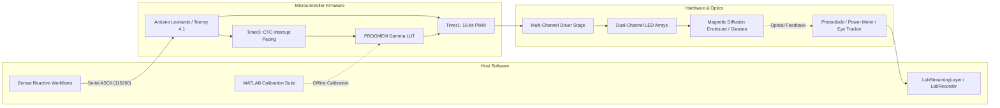

# Full-Field LED Visual Stimulator

An open-source, high-precision visual stimulation platform designed for visual neuroscience, sensory physiology, and human psychophysics. The system delivers temporally agile, multi-chromatic optical stimulation (e.g., Green for M-cones/rods and UV for S-cones, or custom multi-spectral arrays) with sub-millisecond precision.

https://github.com/user-attachments/assets/08af2269-a270-4899-ae75-62786a714254

*Example stimulus: 2 Hz antiphase (Green / UV) sinusoidal flicker.*

---

## Key Capabilities

- **High-Resolution Temporal Modulation:** 16-bit Phase-Correct carrier PWM (~7.68–10 kHz) combined with hardware-interrupt pacing (Timer3 CTC ISR) eliminates visible digital stepping and software loop jitter.
- **Rich Stimulus Battery:** Native microsecond-timed generation of sinusoidal flickers, Gaussian white noise (with Central Limit Theorem PRNG), contrast-switching adaptation sequences, exponential frequency chirps, and stepped luminance pulses.
- **Quantitative Radiometric Calibration:** End-to-end MATLAB calibration pipeline mapping raw duty cycles to linearized lookup tables (LUTs) and calculating exact photoreceptor isomerisation rates ($R^*/\text{photoreceptor/s}$).
- **Flexible Form Factors:** Supports both 200mm full-field panel enclosures (with magnetic diffusion clamping) and miniature wearable mounts for Pupil Labs Neon eye-tracking glasses.
- **Reactive Experiment Orchestration:** Full integration with [Bonsai](https://bonsai-rx.org/) for closed-loop, state-dependent, adaptive psychometric staircase, and LabStreamingLayer (LSL) multi-modal recording.

---

## System Architecture



---

## Quickstart Guide

### 1. Flash the Firmware
1. Open [`ArduinoCode/StimulusControlViaSerial_Leonardo_v8/StimulusControlViaSerial_Leonardo_v8.ino`](file:///d:/Code/LEDStimulation/ArduinoCode/StimulusControlViaSerial_Leonardo_v8/StimulusControlViaSerial_Leonardo_v8.ino) in the Arduino IDE.
2. Select **Arduino Leonardo** as your board and choose the corresponding COM port.
3. Click **Upload**.

### 2. Connect Hardware & Verify
1. Connect your LED driver to the designated MCU pins (PWM: Pins 9 & 10; Indicators: Pins 4 & 5).
2. Open the Serial Monitor at `115200` baud.
3. Send a test sinusoidal flicker:
   ```text
   s, 3000, 2.0, 0.0, 0.5, 0.8, 0.8
   ```
   *(Runs a 3-second, 2 Hz antiphase flicker on Channels A and B at 80% contrast).*

### 3. Launch Experimental Workflows
Open [Bonsai](https://bonsai-rx.org/) and load one of the pre-built visual stimulation workflows from [`BonsaiCode/`](file:///d:/Code/LEDStimulation/BonsaiCode/) (e.g., `LEDstimulation_normal.bonsai` or `ManualMethodOfAdjustment.bonsai`).

---

## Documentation Index

Comprehensive guides, schematics, and technical specifications are available in the **[`docs/`](docs/index.md)** directory:

| Section | Description |
| :--- | :--- |
| **[1. Hardware](docs/1-hardware/circuit-and-driver.md)** | [Circuit & Driver](docs/1-hardware/circuit-and-driver.md) • [Custom PCBs](docs/1-hardware/custom-pcbs.md) • [Panel Enclosure](docs/1-hardware/enclosure-and-optics/panel-enclosure.md) • [Wearable Glasses](docs/1-hardware/enclosure-and-optics/wearable-glasses.md) • [Bill of Materials](docs/1-hardware/bill-of-materials.md) |
| **[2. Firmware](docs/2-firmware/architecture-and-timers.md)** | [Architecture & Hardware Timers](docs/2-firmware/architecture-and-timers.md) • [Serial API Reference](docs/2-firmware/serial-api-reference.md) • [Firmware Variants](docs/2-firmware/firmware-variants.md) |
| **[3. Calibration](docs/3-calibration/calibration-guide.md)** | [Calibration Guide](docs/3-calibration/calibration-guide.md) • [Gamma LUT Pipeline](docs/3-calibration/gamma-lut-pipeline.md) • [Photoreceptor Calculations](docs/3-calibration/photoreceptor-calculations.md) |
| **[4. Experimental Workflows](docs/4-experimental-workflows/bonsai-overview.md)** | [Bonsai Setup](docs/4-experimental-workflows/bonsai-overview.md) • [Stimulation Paradigms](docs/4-experimental-workflows/stimulation-paradigms.md) • [Integration & Multi-Modal Sync](docs/4-experimental-workflows/integration-and-sync.md) |
| **[5. Reference](docs/5-reference/performance-and-sync.md)** | [Performance Characteristics, Switching Dynamics & Thermal Notes](docs/5-reference/performance-and-sync.md) |

---

## Repository Structure

```text
├── ArduinoCode/                  # Microcontroller firmware (Leonardo v8, DDS, Teensy 4.1, IMU)
├── BonsaiCode/                   # Main Bonsai visual reactive workflows & stimulus CSVs
├── BonsaiForHumanExperiments/    # Dedicated human psychophysics Bonsai workflows
├── Calibration/                  # MATLAB scripts for radiometry, gamma LUTs & opsin calculations
├── Hardware/                     # CAD files (.stp, .stl, .ipt), KiCad PCB designs & driver schematics
│   ├── Enclosure/                # Baseplate CAD & 3D printed magnetic diffusion clamps
│   ├── glasses/                  # Pupil Labs Neon glasses boom arm & miniature diffuser
│   ├── LED_board/                # KiCad dual-channel LED array PCB
│   └── LED_board_humans/         # KiCad 3-colour LED array PCB (WIP redesign with layout improvements)
├── HumanExpAnalysis/             # MATLAB scripts for IMU movement and behavioural analysis
├── LabRecorderFiles/             # Multi-modal LabStreamingLayer (LSL) recording configurations
└── docs/                         # Modular technical documentation
```

---

## License & Attribution

Developed for scientific research applications. If you use this platform in your research, please cite this repository.
