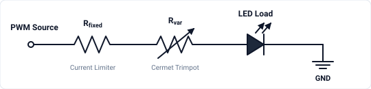
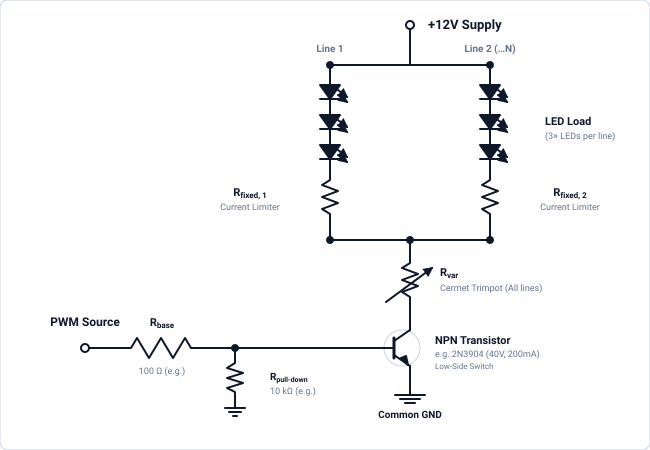

# Circuit & Driver Design

This section describes the electronic drive circuitry used to power and modulate the optical LED loads in the stimulator.

---

## 1. Direct Microcontroller PWM Drive (Base Configuration)

The simplest driving topology connects PWM output (e.g. microcontroller output) directly to the LED load through a series combination of a fixed current-limiting resistor and a multi-turn cermet variable resistor.  This direct-drive topology works when the LED load has voltage ($V_f$) and current ($I_{\text{LED}}$) requirements that fall *well* within the direct drive capability of the microcontroller GPIO pins (typically $V_{\text{pin}} \le 5\text{V}$, $I_{\text{max}} \le 20\text{--}40\text{ mA}$).

* **`PWM Source`:** Outputs a high-frequency PWM carrier providing temporal stimulus patterns.
* **$R_{\text{fixed}}$ (Current Limiter):** Sets the absolute maximum current ceiling to protect both the microcontroller output pin and LED load from overcurrent when $R_{\text{var}} = 0\,\Omega$.
* **$R_{\text{var}}$ (Cermet Trimpot):** Allows manual analog adjustment of maximum forward current and luminance. Using a **cermet** (ceramic-metal thick-film) trimpot is critical for high-frequency PWM visual stimulation. Alternative potentiometer constructions will degrade or disrupt the stimulus.

---

## 2. Low-Side NPN Transistor Switching Drive (12V / Multi-LED Arrays)

When driving multi-LED series strings or larger multi-channel arrays that exceed microcontroller GPIO limits ($5\,\text{V}$ and $20\text{--}40\,\text{mA}$), an external DC power supply (typically $+12\,\text{V}$) is used with a low-side NPN bipolar junction transistor (BJT) switch.

* **`+12V Supply` & Multiple LED Lines:** Powers one or more parallel lines of 3 series LEDs ($V_f \approx 6.3\text{--}9.9\,\text{V}$ per string), leaving optimal voltage headroom from the $12\,\text{V}$ rail.
* **$R_{\text{fixed}}$ (Per-Line Current Limiter):** Each parallel LED line includes its own fixed series resistor to limit and balance current across individual branches.
* **$R_{\text{var}}$ (Master Cermet Trimpot):** A single shared cermet trimpot on the merged return path controls the total current and maximum luminance for **all LED lines simultaneously**.
* **NPN Transistor (Low-Side Switch):** General-purpose small-signal NPN transistor (e.g., **onsemi 2N3904**, rated for $40\,\text{V}$, $200\,\text{mA}$, 3-pin TO-92 package). Sinks the combined load current from all LED lines to ground when switched ON by the PWM signal (ensure total current across all parallel strings remains $\le 200\,\text{mA}$).
* **`PWM Source`, $R_{\text{base}}$ & $R_{\text{pull-down}}$:** The microcontroller PWM output switches the transistor through a base resistor ($R_{\text{base}} \approx 100\,\Omega$). A pull-down resistor ($R_{\text{pull-down}} = 10\,\text{k}\Omega$) keeps the base pulled to $0\,\text{V}$ during microcontroller startup or floating states.
* **Common Ground:** The Arduino ground and the external $12\,\text{V}$ power supply ground **must be connected together** to establish the shared $0\,\text{V}$ reference required for the base-emitter voltage ($V_{BE} \approx 0.7\,\text{V}$) to switch the transistor reliably.
