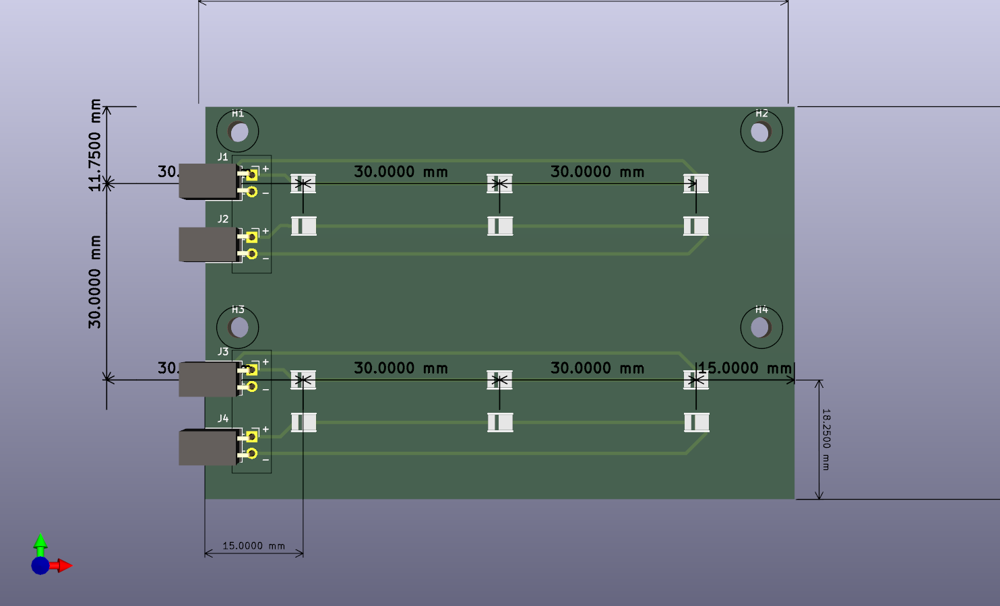
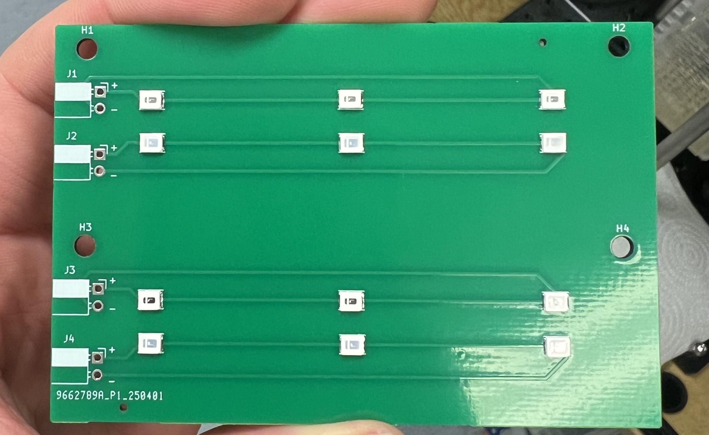
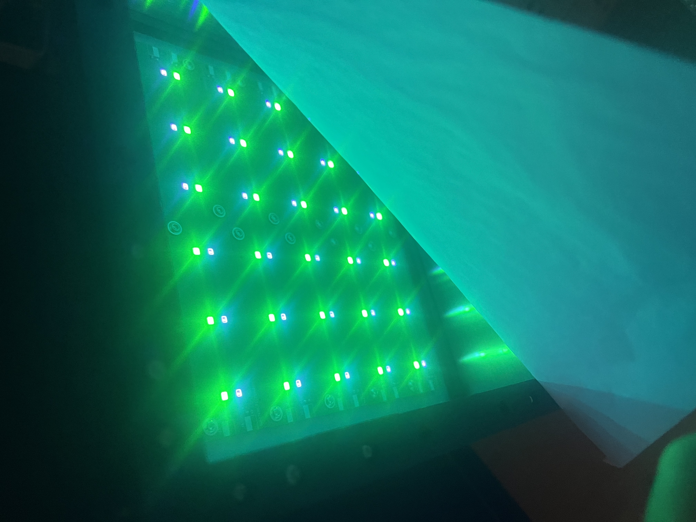

# Custom PCBs

This page documents the custom PCBs designed in KiCad for multi-wavelength LED stimulation and driver interfacing.

---

## 1. Standard LED Array Board (`LED_board`)

* **Location:** [`Hardware/LED_board/`](file:///d:/Code/LEDStimulation/Hardware/LED_board/) | **Status:** **Active**
* **Files:** `LED_board.kicad_sch`, `LED_board.kicad_pcb`, `LED_board.step`, `production/`
* **Acknowledgements:** Board is based on an earlier prototype designed by Andre Maia Chagas.

*Figure: KiCad 3D layout of standard dual-channel LED array board with dimensions and grid pitch.*

*Figure: Assembled dual-channel LED array PCB showing the 4 LED lines, solder pads for J1–J4, and mounting holes H1–H4.*

*Figure: Multiple tiled LED boards mounted inside the panel enclosure and illuminated beneath the optical diffuser sheet.*

### Design & Current Implementation

The board provides wide-field visual stimulation using multiple equally-spaced LED lines:

* **Layout:** 4 lines of LEDs (2 lines per colour, interleaved), with 3 series LEDs per line (12 LEDs total, running at $+12\,\text{V}$).
* **Spacing:** $3\,\text{cm}$ ($30\,\text{mm}$) pitch between lines, matching the spacing across adjacent tiled boards.
* **Mounting:** Through-holes for M3 standoffs to attach securely to the aluminium backplate / heatsink.
* **Connectors:** 4 separate 2-pin ($2.54\,\text{mm}$) headers — one dedicated connector per LED line (8 wires total per board back to the driver). Headers can be straight or right-angled, and can be mounted on the **front or reverse side** of the PCB to route cables cleanly out the back of the backplate.
* **Current Limiting:** External (requires off-board resistors on the driver board).

### Future Improvements

* **On-Board SMD Resistors:** Add dedicated surface-mount ballast resistors (1206 footprint) on each line to balance branch currents directly on the PCB and eliminate off-board resistors.
* **Single Consolidated Connector:** Replace the 4 separate 2-pin headers with a single multi-pin connector (e.g. 4-pin JST-XH). A common $+12\,\text{V}$ anode rail powers all lines, branching into separate low-side return paths per colour for independent PWM modulation (reducing wiring from 8 to 3–4 wires).
* **Modular Daisy-Chaining:** Add pass-through edge connectors so arbitrary boards can be tiled together with parallel electrical connections, preserving the $3\,\text{cm}$ pitch without extra cable runs.

---

## 2. Experimental & In-Development Boards

### 3-Colour LED Array Board (`LED_board_humans`)
* **Location:** [`Hardware/LED_board_humans/`](file:///d:/Code/LEDStimulation/Hardware/LED_board_humans/) | **Status:** ⚠️ **WIP**
* Experimental 3-channel (3-colour) panel redesign with optimized routing. *(Note: Unrelated to the wearable glasses setup).*

### Constant Current Driver Board (`Constant_current_driver`)
* **Location:** [`Hardware/Constant_current_driver/`](file:///d:/Code/LEDStimulation/Hardware/Constant_current_driver/) | **Status:** ⚠️ **WIP (Inactive)**
* Prototype driver board. Current setups use the low-side transistor circuit described in [Circuit & Driver Design](file:///d:/Code/LEDStimulation/docs/1-hardware/circuit-and-driver.md).

---

## 3. Fabrication

Gerber files and drill maps are in the respective `production/` directories, ready for fabrication (e.g. JLCPCB, PCBWay).
