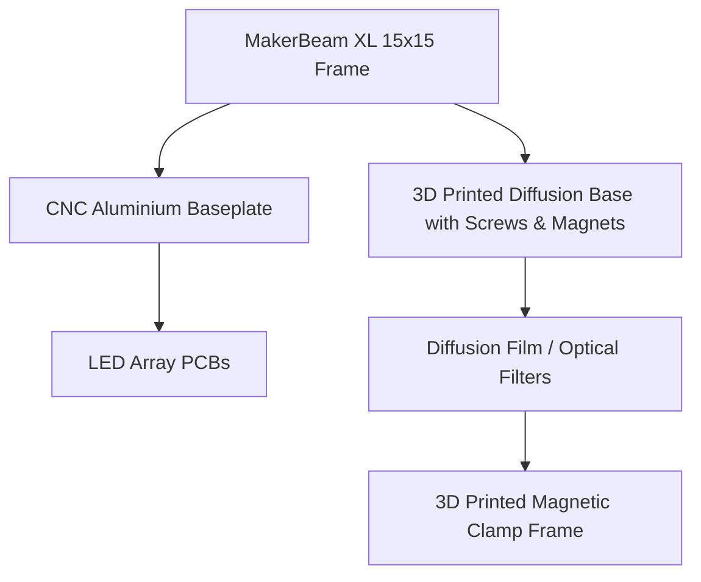
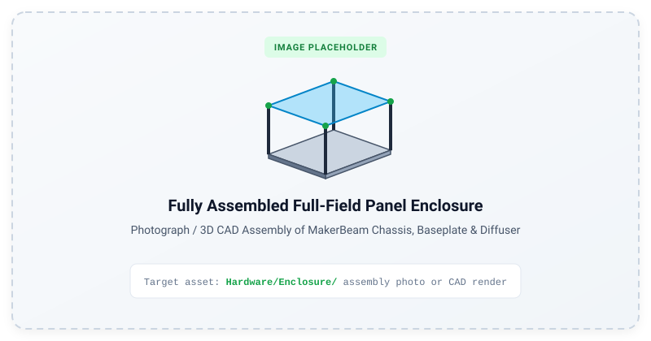
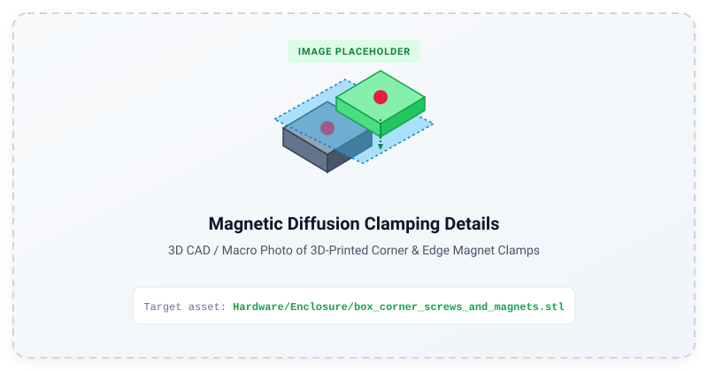

# Full-Field Panel Enclosure & Optics

The full-field visual stimulator utilizes a modular MakerBeam XL frame, precision aluminium baseplates, and 3D printed magnetic diffusion clamps to achieve spatial uniformity and fast optical filter/diffuser swapping.

---

## Mechanical Assembly

*Figure: Fully assembled panel enclosure showing MakerBeam XL framework, CNC aluminium baseplate, mounted LED PCBs, and top magnetic diffuser.*

---

## 1. Frame & Baseplate

* **CAD Models:** [`Hardware/Enclosure/`](file:///d:/Code/LEDStimulation/Hardware/Enclosure/)
  * `Baseplate_for_PCBs_v3.stp` / `.ipt` — Master baseplate CAD for CNC milling or laser cutting.
  * `Baseplate_for_PCBs_v3_section.stl` — 3D printable test section.
* **Extrusions:** 15x15mm MakerBeam XL beams (200mm and 50mm lengths) connected via black anodized corner cubes and M3 button-head socket screws.
* **Thermal Management:** The aluminium baseplate serves as an effective heat sink for the LED arrays and driver circuitry.

---

## 2. Magnetic Diffusion Clamping System

To allow rapid changing of diffusion sheets, neutral density filters, or spectral filters without disassembling the chassis:

*Figure: Detail view of 3D-printed magnetic corner and long-edge clamping elements holding the optical diffusion sheet.*

* **Corner Elements:**
  * Base: `box_corner_screws_and_magnets.stl` (Fastens to the MakerBeam frame with M3 hardware and houses 5mm neodymium magnets).
  * Clamp: `box_corner_just_magnets.stl` (Snaps on top to secure the diffusion sheet).
* **Long Edge Elements:**
  * Base: `box_long_edge_screws_and_magnets.stl`
  * Clamp: `box_long_edge_just_magnets.stl`
* **Batch Print Package:** `UM3_all3dprintedparts.3mf` (UltiMaker / Prusa / Bambu 3MF package containing the complete print set).

---

## 3. Optical Considerations

* **Diffusion Distance:** The distance between the LED PCB plane and the diffusion sheet is set by the 50mm vertical MakerBeam extrusion. This was the minimum for sufficient spatial homogenisation of light. 
* **Diffuser Stacking:** Multiple diffusers can be stacked to produce more homogenised light.
* **Filter Stacking:** Optical diffusers (e.g. holographic or engineered diffusers) can be paired with neutral density filters to extend the dynamic range into scotopic regimes, instead/as well as using the trimpots.
