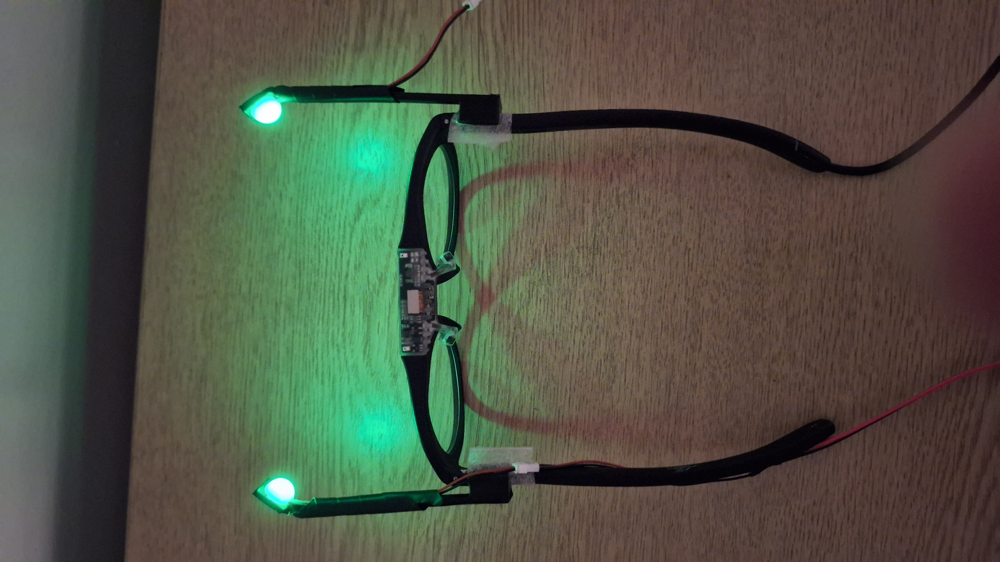
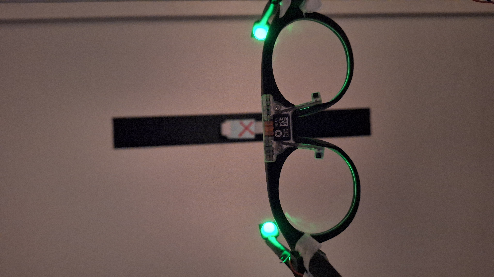
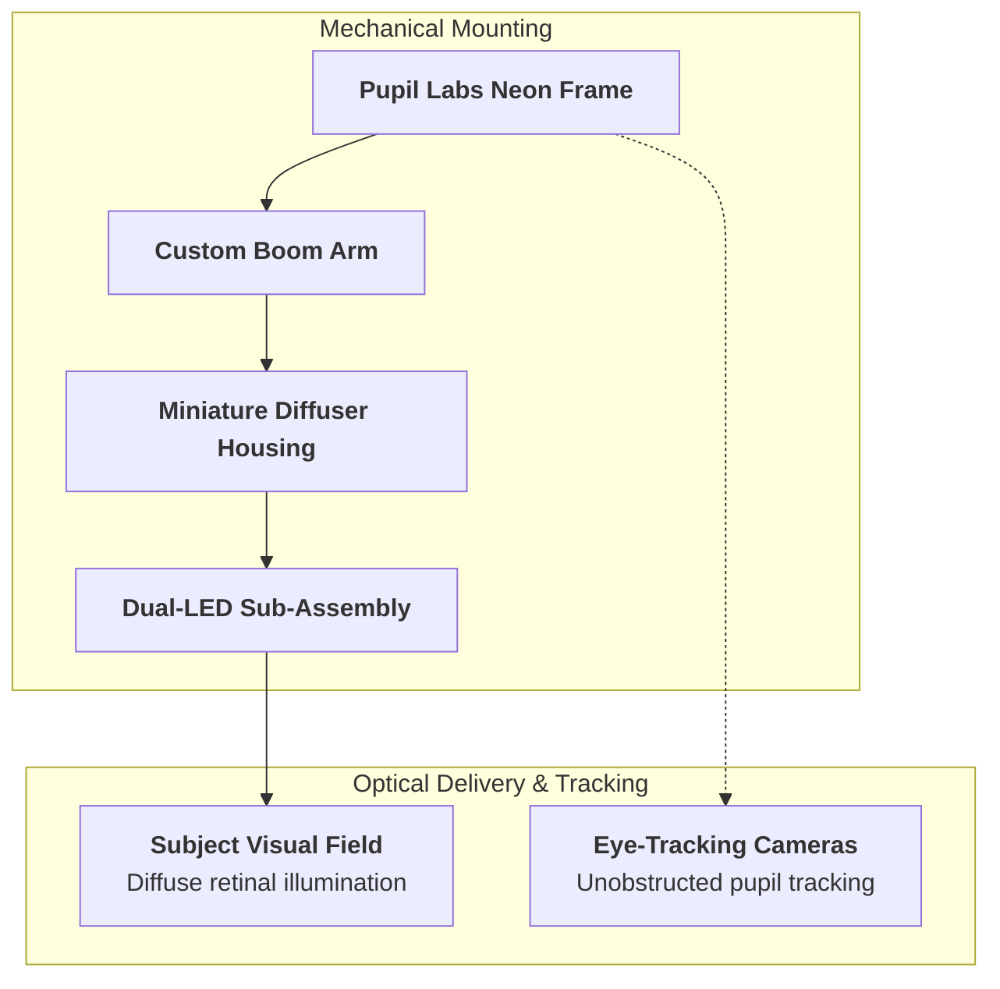

# Wearable Glasses Setup (Pupil Labs Neon Integration)

For human visual psychophysics, mobile experiments, and simultaneous eye-tracking paradigms, a miniature stimulation and diffusion assembly is mounted directly to the **Pupil Labs Neon** eye-tracking frame.

---

## Hardware & 3D Models

* **CAD Location:** [`Hardware/glasses/`](file:///d:/Code/LEDStimulation/Hardware/glasses/)
* **Key Files:**
  * `boom_arm.stl` / `boom_arm.ipt` — Custom 3D printed boom arm that attaches securely to the Neon eye-tracker frame.
  * `diffuser_fullipt.ipt` — Miniature optical diffuser housing that holds the stimulus LED array in front of the subject's visual field without obstructing the eye camera's gaze-tracking optics.
  * `Neon_JAN_frame_reference/` — Reference frame geometries for fit and alignment validation.

  

    
  

  

    
  

*Figure: Earlier prototype of the wearable stimulation glasses mounted to the Pupil Labs Neon eye-tracking frame. Left: Full frame assembly with boom arms and temple-routed wiring. Right: Close-up of illuminated miniature diffuser domes in front of the visual field without obstructing gaze-tracking cameras.*

---

## Assembly & Alignment

1. **Boom Arm Attachment:** The boom arm securely clips/fastens to the Neon eye-tracker frame without altering gaze-calibration geometry.
2. **Diffuser & LED Insertion:** The miniature LED assembly seats directly into the diffuser housing (`diffuser_fullipt.ipt`), placing an evenly diffused light source in the peripheral or full visual field.
3. **Cable Routing:** Lightweight, flexible silicone wiring runs along the glasses temple to prevent torque or movement artifacts during natural head motion and walking tasks.
