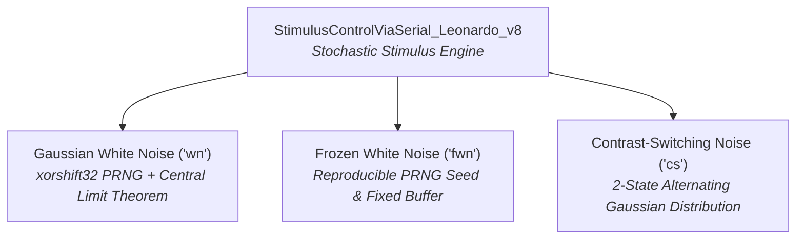

# Firmware Architecture & System Principles

The visual stimulation platform utilizes bare-metal microcontroller firmware to deliver sub-millisecond temporal precision, high carrier frequencies, and artifact-free luminance modulation.

We use primarily the **Arduino Leonardo (ATmega32U4 @ 16 MHz)**, which possesses several hardware properties that make it well suited for high-precision optical stimulation:

* **Native USB Communication (CDC):** The ATmega32U4 features native on-chip USB communication, avoiding the transfer latency, buffer bloat, and jitter introduced by external USB-to-UART bridge chips (e.g., FTDI / CH340).
* **Deterministic 16-bit Timer Registers:** Direct bare-metal control of hardware `Timer1` allows 31.25 kHz Phase Correct PWM with cycle-accurate register writes (`OCR1A`, `OCR1B`).
* **Sub-Microsecond Timing Determinism:** Without an underlying RTOS or thread scheduler, interrupt service routines execute with sub-microsecond predictability.
* **Cost & Accessibility:** Standardized, open-source form factor that is cost-effective and readily replicable across research laboratories.

Other microcontrollers can also be used if higher bit-depth, clock speed, or sample rates are desired—such as the **PJRC Teensy 4.1 (ARM Cortex-M7 @ 600 MHz)**, for which a 12-bit, 36.62 kHz DDS implementation ([`LEDStimController_Teensy41_DDS.ino`](file:///d:/Code/LEDStimulation/ArduinoCode/LEDStimController_Teensy41_DDS/LEDStimController_Teensy41_DDS.ino)) is provided.

The primary canonical firmware is **[`StimulusControlViaSerial_Leonardo_DDS_8bit_2freq.ino`](file:///d:/Code/LEDStimulation/ArduinoCode/StimulusControlViaSerial_Leonardo_DDS_8bit_2freq/StimulusControlViaSerial_Leonardo_DDS_8bit_2freq.ino)**, implementing a **Direct Digital Synthesis (DDS)** engine running at a **31.25 kHz** carrier frequency.

---

## 1. Canonical System Architecture (`DDS_8bit_2freq`)

The canonical firmware synchronizes carrier PWM generation and stimulus waveform synthesis at **31.25 kHz** using Direct Digital Synthesis (DDS).

* **Command Ingestion:** ASCII commands received over USB Serial at 115200 baud are parsed and configured into stimulus state parameters (frequencies, phases, contrasts, durations).
* **High-Frequency Carrier:** Hardware `Timer1` generates a 31.25 kHz Phase Correct PWM carrier on Pin 9 (Channel A) and Pin 10 (Channel B).
* **Synchronous Interrupt Pacing:** The `TIMER1_OVF_vect` interrupt fires synchronously on every PWM cycle at 31.25 kHz ($32\ \mu\text{s}$ period), invoking a dynamic callback function pointer (`timer1Callback`).
* **DDS Waveform Synthesis:** The 32-bit phase accumulators advance each cycle, indexing into a 256-sample sine wavetable, and applying raised cosine onset/offset envelopes or contrast envelopes.
* **Optical Linearization:** The calculated luminance index is mapped through Flash-resident (`PROGMEM`) gamma Look-Up Tables before being written directly to `OCR1A` and `OCR1B`.

---

## 2. Core Architectural Principles

### 2.1. Direct Digital Synthesis (DDS) Engine

Rather than stepping through a wavetable with variable timer interrupts, the DDS engine uses **32-bit fixed-point phase accumulators** updated at every single PWM carrier cycle ($31.25\text{ kHz}$):

$$\Delta\theta = \text{round}\left(f_{\text{stimulus}} \times \frac{2^{32}}{f_{\text{PWM}}}\right)$$

On an ATmega32U4 running at 16 MHz with a $31.25\text{ kHz}$ PWM carrier, the scaling constant is pre-computed with IEEE 754 precision:

$$\frac{2^{32}}{31250} = 137438.953125$$

```cpp
uint32_t calcPhaseInc(float freq) {
    // 4294967296.0 / 31250.0 = 137438.953125
    return (uint32_t)(freq * 137438.953125f + 0.5f);
}
```

* **Instantaneous Frequency & Phase Transitions:** Frequency changes require simply writing a new 32-bit phase increment value (`phaseIncrementA = calcPhaseInc(newFreq)`). There are zero phase discontinuities, zero timer reconfiguration delays, and no waveform glitches.
* **Wavetable Indexing:** The most significant byte of the 32-bit accumulator directly selects the sample from a 256-point sinusoidal wavetable:
  ```cpp
  uint8_t indexA = ((uint8_t*)&phaseAccumulatorA)[3]; // Instantaneous byte extraction
  ```

---

### 2.2. High-Frequency Carrier Generation & Timer1 PWM Configuration

`Timer1` on the ATmega32U4 is configured in **16-bit Phase Correct PWM mode (Mode 10)**. In this dual-slope mode, the timer counts continuously up from $0$ to `ICR1` (TOP) and then counts down from `ICR1` back to $0$.

The resulting PWM carrier frequency is given by:

$$f_{\text{PWM}} = \frac{f_{\text{CPU}}}{2 \times N \times \text{TOP}}$$

For a target frequency of $31.25\text{ kHz}$ with a $16\text{ MHz}$ CPU clock, the prescaler is $N = 1$ and $\text{TOP} = 256$:

$$f_{\text{PWM}} = \frac{16\text{ MHz}}{2 \times 1 \times 256} = 31.25\text{ kHz}$$

* **Elimination of Saccadic CFF Artifacts:** The Critical Flicker Fusion (CFF) threshold in rodents and primates is typically $< 60-100\text{ Hz}$. Operating at $31.25\text{ kHz}$ guarantees that rapid eye movements or micro-saccades can never visually resolve carrier switching.
* **Photodiode & Recording Immunity:** High-speed electrophysiological amplifiers and photodiodes are immune to carrier ringing at $31.25\text{ kHz}$.
* **Acoustic Silence:** Prevents audible coil whine from inductors or ceramic capacitors in the driver circuitry.

#### Step 1: Calculating Prescaler and TOP

The firmware calculates the optimal prescaler ($N \in \{1, 8, 64, 256, 1024\}$) and `TOP` value dynamically to maximize bit-depth resolution:

```cpp
long calculatePrescalerAndTOP(long desiredFrequency, long &prescaler) {
  long TOP = 0;
  long possiblePrescalers[] = { 1, 8, 64, 256, 1024 };

  for (int i = 0; i < 5; i++) {
    long currentPrescaler = possiblePrescalers[i];
    long calculatedTOP = (CLOCK_FREQ / (2 * currentPrescaler * desiredFrequency));

    if (calculatedTOP >= 0 && calculatedTOP <= 65535) {
      prescaler = currentPrescaler;
      TOP = calculatedTOP;
      break;  // Select the smallest valid prescaler for maximum resolution
    }
  }
  return TOP;
}
```

For $31250\text{ Hz}$, the algorithm selects `prescaler = 1` and `TOP = 256` ($8\text{-bit}$ resolution).

#### Step 2: Register-Level Timer1 Setup

The `configureTimer1()` function directly writes to the ATmega32U4 control registers (`TCCR1A`, `TCCR1B`, `ICR1`):

```cpp
void configureTimer1(long prescaler, long TOP) {
  // Reset Timer1 control registers
  TCCR1A = 0;
  TCCR1B = 0;

  // Enable non-inverting PWM output on Pin 9 (OC1A) and Pin 10 (OC1B)
  TCCR1A |= (1 << COM1A1);  
  TCCR1A |= (1 << COM1B1);  

  // Configure Phase Correct PWM with ICR1 as TOP (Mode 10)
  TCCR1B |= (1 << WGM13);   
  TCCR1B &= ~(1 << WGM12);  
  TCCR1A &= ~(1 << WGM11);  
  TCCR1A &= ~(1 << WGM10);  

  // Apply clock prescaler
  switch (prescaler) {
    case 1:    TCCR1B |= (1 << CS10); break;               // Prescaler = 1 (No division)
    case 8:    TCCR1B |= (1 << CS11); break;               // Prescaler = 8
    case 64:   TCCR1B |= (1 << CS11) | (1 << CS10); break; // Prescaler = 64
    case 256:  TCCR1B |= (1 << CS12); break;               // Prescaler = 256
    case 1024: TCCR1B |= (1 << CS12) | (1 << CS10); break; // Prescaler = 1024
  }

  // Set the TOP counter limit (ICR1 = 256)
  ICR1 = TOP;
}
```

* `COM1A1` & `COM1B1`: Enable non-inverting compare mode on OC1A (Pin 9) and OC1B (Pin 10). The pin clears on compare match when counting up, and sets on compare match when counting down.
* `WGM13 = 1` (with `WGM12=0`, `WGM11=0`, `WGM10=0`): Sets dual-slope Phase Correct PWM with `ICR1` acting as the TOP limit.
* `CS10 = 1`: Connects the 16 MHz system clock directly without prescaling ($N=1$).
* `ICR1 = 256`: Establishes the peak counter value.

#### Step 3: Fast Inline Output Writes

Luminance duty cycles are updated by writing directly to `OCR1A` and `OCR1B`, reading calibrated values from `PROGMEM` Flash tables:

```cpp
__attribute__((always_inline)) inline void setChA(uint8_t ocrValue) {
  OCR1A = pgm_read_byte_near(currentChALUT + ocrValue);
}

__attribute__((always_inline)) inline void setChB(uint8_t ocrValue) {
  OCR1B = pgm_read_byte_near(currentChBLUT + ocrValue);
}
```

#### Step 4: Synchronous Interrupt Coupling (`TIMER1_OVF_vect`)

In Phase Correct PWM mode, the timer overflow interrupt flag (`TOV1`) is set every time the counter reaches bottom ($0$). The firmware uses this interrupt to synchronously trigger the DDS waveform synthesis at $31.25\text{ kHz}$:

```cpp
void (*timer1Callback)() = nullptr;  

void setTimer1Callback(void (*callback)()) {
  timer1Callback = callback;
}

void startTimer1Interrupt() {
  TIFR1 |= (1 << TOV1);     // Clear any pending overflow flag
  TIMSK1 |= (1 << TOIE1);   // Enable Timer1 Overflow Interrupt
}

void stopTimer1Interrupt() {
  TIMSK1 &= ~(1 << TOIE1);  // Disable Timer1 Overflow Interrupt
}

ISR(TIMER1_OVF_vect) {
  if (timer1Callback) {
    timer1Callback();       // Executes DDS synthesis at 31.25 kHz
  }
}
```

---

### 2.3. Dual Independent Channels & Frequencies

`StimulusControlViaSerial_Leonardo_DDS_8bit_2freq` maintains independent 32-bit phase accumulators and phase increments for Channel A and Channel B:

* **Dichoptic Stimulation:** Present distinct frequencies simultaneously to each eye (e.g., $5\text{ Hz}$ on Left Eye, $7\text{ Hz}$ on Right Eye).
* **Chromatic & Dual-Wavelength Probing:** Drive Green ($530\text{ nm}$) and UV ($395\text{ nm}$) LEDs with independent phase relationships ($0^\circ$ in-phase vs. $180^\circ$ antiphase) and independent contrast levels.

---

### 2.4. Raised Cosine Temporal Windowing (Fade In/Out)

Sudden rectangular onsets of bright visual flicker can trigger retinal startle responses and severe transient visual evoked potentials (VEPs).

The firmware applies a smooth **Modular Raised Cosine Temporal Window** (default $100\text{ ms}$):

* A 64-entry pre-computed envelope table (`raisedCosineLUT[64]`) scales the contrast from $0 \to 100\%$ at stimulus onset and $100\% \to 0$ at stimulus offset.
* A 32-bit addition accumulator (`fadePhase += envStep`) steps through the envelope table without runtime multiplication or floating-point trigonometry.

---

### 2.5. Jitter Elimination & USB Heartbeat Suppression

Under normal Arduino operation, the USB Start-of-Frame (SOF) interrupt fires every $1.0\text{ ms}$, and `Timer0` fires every $1.024\text{ ms}$ for `millis()`. These interrupts cause microsecond-scale jitter and cumulative timing drift ($\approx 10.5\text{ ms}$ slip over long trials).

During active stimulation, the firmware temporarily suppresses these interrupts:

```cpp
TIMSK0 &= ~_BV(TOIE0);  // Disable Timer0 millis() interrupt
UDIEN &= ~(1 << SOFE);  // Disable USB Start-of-Frame interrupt
```

Upon trial completion, both interrupts are re-enabled, ensuring zero timing slip during stimulation while retaining full USB communication.

---

### 2.6. Lock-Free Atomic Synchronization

To avoid global interrupt blocking (`cli()` / `sei()`) that could introduce carrier jitter, the firmware uses a double-read atomic pattern to safely read multi-byte cycle counters between the main loop and ISR:

```cpp
uint32_t safeCycles1, safeCycles2;
do {
    safeCycles1 = completedCycles;
    safeCycles2 = completedCycles;
} while (safeCycles1 != safeCycles2);
```

---

## 3. Sinewave Trial Execution Lifecycle (End-to-End Walkthrough)

When host software (e.g. Bonsai or Python) requests a sinusoidal flicker trial, the firmware executes a precise sequence across serial ingestion, parameter arming, interrupt-driven synthesis, and completion handshake.

```
[Host PC]  -- "s,5000,4.0,4.0,0.0,0.5,0.8,0.8\r" -->  [Serial Parser]
                                                              |
                                                    [outputSinewave()]
                                                    (Arm DDS, Phase, Fade)
                                                              |
                                            [Disable Timer0 & USB SOF]
                                            [Attach Timer1 OVF Callback]
                                                              |
                                          [31.25 kHz sinewaveInterrupt()]
                                          (DDS step, Fade, LUT, OCR1A/B)
                                                              |
                                           [Target Interrupts Reached]
                                                              |
                                            [Restore Interrupts & Pins]
[Host PC]  <------------- "-1\n" Handshake ----------- [Serial Print]
```

### Step 1: Serial Command Ingestion & Parsing

The main `loop()` continuously monitors incoming characters over USB CDC:

```cpp
void loop() {
  GetSerialInput();
  if (newData) {
    newData = false;
    ActionSerial();
  }
}
```

When a carriage return (`\r`) is received, `ActionSerial()` tokenizes the comma-separated ASCII string:

```cpp
// Example input: "s, 5000, 4.0, 4.0, 0.0, 0.5, 0.8, 0.8"
if (strcmp(FirstChar, "s") == 0) {
  long stimulusDuration = atof(serialVals[1]); // Duration (ms)
  float freqA = atof(serialVals[2]);           // Channel A Frequency (Hz)
  float freqB = atof(serialVals[3]);           // Channel B Frequency (Hz)
  float phaseA = atof(serialVals[4]);         // Channel A Starting Phase (0.0-1.0)
  float phaseB = atof(serialVals[5]);         // Channel B Starting Phase (0.0-1.0)
  float contrastA = atof(serialVals[6]);      // Channel A Contrast (0.0-1.0)
  float contrastB = atof(serialVals[7]);      // Channel B Contrast (0.0-1.0)

  outputSinewave(freqA, freqB, stimulusDuration, phaseA, phaseB, contrastA, contrastB);
}
```

---

### Step 2: Pre-Computing Trial Parameters & Arming the Hardware

Inside `outputSinewave()`, parameters are converted into fast integer representations before starting interrupts:

```cpp
void outputSinewave(float freqA, float freqB, long duration, float phaseA, float phaseB, float contrastA, float contrastB) {
  // 1. Convert phase offsets (0.0-1.0) to full 32-bit phase accumulator starting values
  phaseAccumulatorA = (uint32_t)(phaseA * 4294967296.0);
  phaseAccumulatorB = (uint32_t)(phaseB * 4294967296.0);

  // 2. Scale contrast floats (0.0-1.0) to 8-bit integer multipliers (0-255)
  contrastMultIntA = (uint16_t)(contrastA * 255.0);
  contrastMultIntB = (uint16_t)(contrastB * 255.0);

  // 3. Compute 32-bit DDS phase increments for both channels
  phaseIncrementA = calcPhaseInc(freqA);
  phaseIncrementB = calcPhaseInc(freqB);

  // 4. Calculate total PWM carrier cycles required for the requested trial duration
  targetTotalInterrupts = (unsigned long)((duration / 1000.0) * actualPWMFreq);

  // 5. Configure the 100ms Raised Cosine onset and offset fade boundaries
  float fadeTimeMs = FADE_DURATION_MS;
  if (fadeTimeMs > 0.0) {
    fadeInterrupts = (unsigned long)(actualPWMFreq * (fadeTimeMs / 1000.0));
    fadeOutStartInterrupt = targetTotalInterrupts - fadeInterrupts;
    envStep = (((uint32_t)FADE_LUT_MAX << 16) + fadeInterrupts - 1) / fadeInterrupts;
  }

  currentTick = 0;
  completedCycles = 0;
  fadePhase = 0;
  stimulusActive = true;

  // 6. Set channels to baseline mid-luminance (50% duty cycle)
  if (useChA) { setChA(MidLumi); }
  if (useChB) { setChB(MidLumi); }

  // 7. Drive hardware indicator pins HIGH (Pin 5 = Stimulus ON, Pin 4 = Frame/Cycle indicator)
  PORTC |= (1 << PORTC6); // Pin 5 HIGH
  PORTD |= (1 << PIND4);  // Pin 4 HIGH

  // 8. Temporarily disable Timer0 and USB SOF interrupts to prevent microsecond jitter
  TIMSK0 &= ~_BV(TOIE0);
  UDIEN &= ~(1 << SOFE);

  // 9. Attach the callback and start the 31.25 kHz Timer1 interrupt
  setTimer1Callback(sinewaveInterrupt);
  startTimer1Interrupt();

  // 10. Jitter-free wait loop (Main loop idles cleanly while ISR drives hardware)
  while (stimulusActive) {
    // Peacefully idle
  }

  // 11. Trial Teardown
  stopTimer1Interrupt();
  TIMSK0 |= _BV(TOIE0);   // Re-enable Timer0
  UDIEN |= (1 << SOFE);   // Re-enable USB SOF

  PORTD &= ~(1 << PIND4); // Pin 4 LOW
  PORTC &= ~(1 << PORTC6); // Pin 5 LOW

  // 12. Reset to baseline and send completion handshake
  if (useChA) { setChA(TopLumi / 2); }
  if (useChB) { setChB(TopLumi / 2); }
  delayMicroseconds(2000);
  Serial.print(F("-1\n"));
}
```

---

### Step 3: Synchronous Waveform Synthesis (`sinewaveInterrupt()` @ 31.25 kHz)

Every $32\ \mu\text{s}$, the Timer1 overflow interrupt triggers `sinewaveInterrupt()`. The entire routine executes in under $4\ \mu\text{s}$ using pure fixed-point arithmetic:

```cpp
void sinewaveInterrupt() {
  uint8_t currentEnvelope = 255;

  // 1. Calculate the active Raised Cosine fade envelope (Onset Ramp vs Steady State vs Offset Ramp)
  if (currentTick < fadeInterrupts) {
    fadePhase += envStep;
    uint16_t envIndex = fadePhase >> 16;
    if (envIndex > FADE_LUT_MAX) envIndex = FADE_LUT_MAX;
    currentEnvelope = raisedCosineLUT[envIndex];
  } else if (currentTick == fadeOutStartInterrupt) {
    fadePhase = 0;
    currentEnvelope = raisedCosineLUT[FADE_LUT_MAX];
  } else if (currentTick > fadeOutStartInterrupt) {
    fadePhase += envStep;
    uint16_t shiftPhase = fadePhase >> 16;
    uint16_t envIndex = (shiftPhase >= FADE_LUT_MAX) ? 0 : (FADE_LUT_MAX - shiftPhase);
    currentEnvelope = raisedCosineLUT[envIndex];
  }

  // 2. Track master elapsed clock and check for trial completion
  currentTick++;
  if (currentTick >= targetTotalInterrupts) {
    stimulusActive = false; // Signals the main loop to exit
  }

  // 3. Modulate requested contrast depth by the temporal envelope
  uint16_t effectiveContrastA = ((uint16_t)contrastMultIntA * (uint16_t)currentEnvelope) >> 8;
  uint16_t effectiveContrastB = ((uint16_t)contrastMultIntB * (uint16_t)currentEnvelope) >> 8;

  // 4. Advance 32-bit phase accumulators by the DDS phase increments
  uint32_t oldPhaseA = phaseAccumulatorA;
  phaseAccumulatorA += phaseIncrementA;
  phaseAccumulatorB += phaseIncrementB;

  // 5. Toggle Pin 4 on full cycle wrap-around to provide hardware cycle tracking
  if (phaseAccumulatorA < oldPhaseA) {
    completedCycles++;
    PIND = (1 << PIND4); // Hardware toggle Pin 4
  }

  // 6. Fast bitwise extraction of high byte for wavetable lookup (256 entries)
  uint8_t indexA = ((uint8_t*)&phaseAccumulatorA)[3];
  uint8_t indexB = ((uint8_t*)&phaseAccumulatorB)[3];

  // 7. Apply contrast depth around MidLumi (50% baseline)
  int16_t tempA = (int16_t)sineWaveTable[indexA] - (int16_t)MidLumi;
  int16_t ocrValA_calc = (int16_t)MidLumi + ((tempA * (int16_t)effectiveContrastA) >> 8);
  if (ocrValA_calc < 0) ocrValA_calc = 0;
  if (ocrValA_calc > 255) ocrValA_calc = 255;
  uint8_t ocrValA = (uint8_t)ocrValA_calc;

  int16_t tempB = (int16_t)sineWaveTable[indexB] - (int16_t)MidLumi;
  int16_t ocrValB_calc = (int16_t)MidLumi + ((tempB * (int16_t)effectiveContrastB) >> 8);
  if (ocrValB_calc < 0) ocrValB_calc = 0;
  if (ocrValB_calc > 255) ocrValB_calc = 255;
  uint8_t ocrValB = (uint8_t)ocrValB_calc;

  // 8. Lookup gamma-corrected register values and write directly to OCR1A and OCR1B
  if (useChA) { setChA(ocrValA); }
  if (useChB) { setChB(ocrValB); }
}
```

---

## 4. Additional Stimulus Engines (from v8 Firmware)

While the DDS firmware is the primary engine for smooth sinusoidal, frequency sweep, and contrast envelope stimulation, the **[`StimulusControlViaSerial_Leonardo_v8.ino`](file:///d:/Code/LEDStimulation/ArduinoCode/StimulusControlViaSerial_Leonardo_v8/StimulusControlViaSerial_Leonardo_v8.ino)** firmware provides specialized stochastic noise stimuli:



### 4.1. Real-Time Gaussian White Noise (`wn`)

* **PRNG Engine (`xorshift32`):** Generates high-entropy 32-bit pseudo-random numbers in just 3 clock cycles.
* **Central Limit Theorem (CLT) Gaussian Approximation:** Instead of computationally heavy Box-Muller transformations, sums $N = 10$ uniform random variables:
    $$
    Z = \frac{\sum_{i=1}^{10} U_i - \mu_{\text{sum}}}{\sigma_{\text{sum}}} \sim \mathcal{N}(0, 1)
    $$
* **Luminance Mapping:** Scales $Z$ by `target_std` and offsets by `target_mean` to produce dynamic Gaussian luminance frames updated at discrete intervals (e.g. $10\text{ ms} = 100\text{ Hz}$).

### 4.2. Frozen White Noise (`fwn`)

* Pre-computes a deterministic Gaussian sequence into an SRAM buffer (`frozenWhiteNoiseTable[375]`) using a specific seed (`randSeedNum`).
* Loops the exact sequence `nReps` times to allow trial-averaged neural response analysis (e.g., Spike-Triggered Averaging / Receptive Field Mapping).

### 4.3. Contrast-Switching Adaptation Noise (`cs`)

* Alternates periodically between two Gaussian distributions (e.g., State 1: 5% contrast vs. State 2: 25% contrast) every `switchTime` ms.
* Used to probe the kinetics of sensory gain control and neural contrast adaptation.

---

## 5. Gamma Linearization & Look-Up Tables

Both firmware variants use Flash-resident (`PROGMEM`) Look-Up Tables to perform real-time optical linearization without runtime floating-point power equations:

```cpp
__attribute__((always_inline)) inline void setChA(uint8_t ocrValue) {
    OCR1A = pgm_read_byte_near(currentChALUT + ocrValue);
}
```

* **Bank Switching (`agc`):** The active LUT bank can be dynamically switched between Bank 1 (linear/identity) and Bank 2 (calibrated empirical gamma curve) via serial command.
