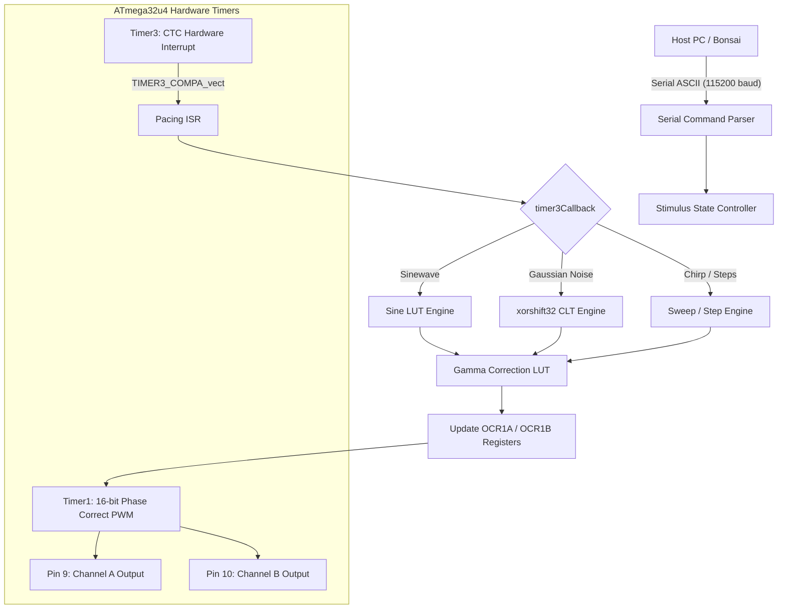

# Firmware Architecture & Timer Configuration

The firmware operates on bare-metal register manipulation of the ATmega32u4 hardware timers to deliver sub-millisecond temporal precision and high-resolution luminance modulation without software loop jitter.

---

## System Architecture

---

## 1. Timer1: High-Resolution PWM Generation

Timer1 generates the high-frequency carrier PWM signals for LED Channels A and B.

* **Waveform Generation Mode (WGM):** Configured for **16-bit Phase Correct PWM (Mode 10)** where the counter counts up to `ICR1` (Input Capture Register) and then down to zero.
  * Setting: `WGM13 = 1`, `WGM12 = 0`, `WGM11 = 0`, `WGM10 = 0` via registers `TCCR1A` and `TCCR1B`.
* **Frequency & Resolution Trade-off:**
  * Base frequency target: $\approx 7.68\text{ kHz}$ (or up to $10\text{ kHz}$ depending on prescaler).
  * Dynamic calculation of optimal Prescaler ($1, 8, 64, 256, 1024$) and `ICR1` (TOP) maximizes effective bit-depth resolution up to 16 bits.
* **Output Pins:**
  * **Channel A (Pin 9 / OC1A):** Duty cycle set by `OCR1A`.
  * **Channel B (Pin 10 / OC1B):** Duty cycle set by `OCR1B`.
  * Non-inverting mode enabled via `COM1A1 = 1` and `COM1B1 = 1`.

---

## 2. Timer3: Deterministic Stimulus Pacing

Timer3 drives the discrete temporal updates of the stimulus waveform (e.g. stepping to the next phase in a sine wave, or generating the next Gaussian noise frame). It operates independently of the main Arduino `loop()`.

* **Waveform Generation Mode:** Configured in **CTC Mode (Clear Timer on Compare)**.
  * Setting: `WGM32 = 1` in `TCCR3B`.
* **Interrupt Service Routine (ISR):**
  * Hardware interrupt enabled via `OCIE3A` in `TIMSK3`.
  * Fires `TIMER3_COMPA_vect` whenever Timer3 counter matches `OCR3A`.
* **Dynamic Function Pointer Architecture:**
  * The firmware employs a dynamic function pointer (`void (*timer3Callback)()`).
  * When a stimulus starts, `timer3Callback` is assigned to the specific generation function (e.g., `sinewaveInterrupt()`, `whiteNoiseInterrupt()`, `chirpInterrupt()`), eliminating conditional branch overhead inside the timing-critical ISR.

---

## 3. High-Speed Gaussian Noise Generation (`xorshift32`)

For white noise and adaptation stimuli:
* **Pseudo-Random Number Generator (PRNG):** Uses `xorshift32`, a lightweight 32-bit shift-register algorithm capable of executing in a handful of clock cycles.
* **Gaussian Approximation via Central Limit Theorem (CLT):**
  * Multiple uniform random samples ($N = 12$) from `xorshift32` are summed and centered:
    $$Z = \sum_{i=1}^{12} U_i - 6$$
  * Produces a zero-mean, unit-variance Gaussian distribution without costly floating-point transcendental functions (e.g., Box-Muller).

---

## 4. Gamma Linearization & Look-Up Tables

* **PROGMEM Look-Up Tables:** Sinewave templates and gamma linearization curves are pre-computed and stored in Flash memory (`PROGMEM`) to conserve SRAM.
* **Gamma Transformation:** Raw normalized intensity requests ($0.0 - 1.0$) index into the active gamma LUT, yielding the exact `OCR1A`/`OCR1B` register values required for linearized optical output.
