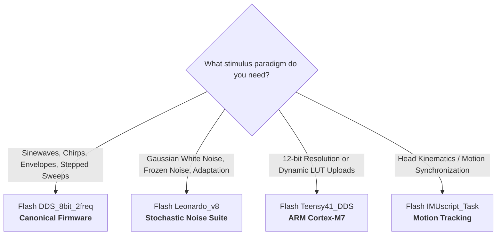

# Firmware Variants & Selection Guide

The repository includes several firmware variants developed for different microcontrollers, experimental paradigms, and rig configurations.

---

## Firmware Variant Matrix

| Sketch Directory | Target MCU | Core Engine | Key Features | Status |
| :--- | :--- | :--- | :--- | :--- |
| **[`StimulusControlViaSerial_Leonardo_DDS_8bit_2freq`](file:///d:/Code/LEDStimulation/ArduinoCode/StimulusControlViaSerial_Leonardo_DDS_8bit_2freq/)** | Arduino Leonardo (ATmega32U4) | Direct Digital Synthesis (DDS) @ 31.25 kHz | Dual independent channel frequencies (`freqA`, `freqB`), raised cosine onset/offset envelopes, contrast envelope modulation (`se`), continuous/stepped sweeps | **Canonical / Primary** |
| **[`StimulusControlViaSerial_Leonardo_v8`](file:///d:/Code/LEDStimulation/ArduinoCode/StimulusControlViaSerial_Leonardo_v8/)** | Arduino Leonardo (ATmega32U4) | Dual Timer (Timer1 PWM + Timer3 CTC ISR) | Stochastic stimuli suite: Gaussian white noise (`wn`), frozen noise (`fwn`), contrast-switching adaptation noise (`cs`) | **Specialized / Extra Stimuli** |
| **[`StimulusControlViaSerial_Leonardo_DDS_8bit_mouseRig`](file:///d:/Code/LEDStimulation/ArduinoCode/StimulusControlViaSerial_Leonardo_DDS_8bit_mouseRig/)** | Arduino Leonardo (ATmega32U4) | Direct Digital Synthesis (DDS) @ 31.25 kHz | Single-frequency DDS variant configured with calibrated gamma LUTs for the mouse physiology rig | **Active / Rig-Specific** |
| **[`LEDStimController_Teensy41_DDS`](file:///d:/Code/LEDStimulation/ArduinoCode/LEDStimController_Teensy41_DDS/)** | Teensy 4.1 (ARM Cortex-M7 @ 600MHz) | FlexPWM (12-bit @ 36.6 kHz) + IntervalTimer DDS | 4096-entry sine table, runtime gamma LUT streaming (`loadlut`), post-LUT brightness scaling (`bright`) | **High-Performance Alternative** |
| **[`IMUscript_Task`](file:///d:/Code/LEDStimulation/ArduinoCode/IMUscript_Task/)** | Arduino Leonardo / Compatible | Serial IMU Data Acquisition | Real-time 6-DOF IMU streaming for movement and gait synchronization in human psychophysics | **Auxiliary / Motion Tracking** |

---

## 1. Canonical Firmware: `StimulusControlViaSerial_Leonardo_DDS_8bit_2freq`

This is the **primary, recommended firmware** for general visual stimulation experiments.

* **Target Hardware:** Arduino Leonardo (ATmega32U4 @ 16 MHz).
* **PWM Carrier:** 31.25 kHz (Timer1 Phase Correct PWM, Mode 10, TOP = 256).
* **Waveform Synthesis:** 32-bit Direct Digital Synthesis (DDS) phase accumulator updated synchronously on every PWM cycle via `TIMER1_OVF_vect`.
* **Key Capabilities:**
    * **Dual-Frequency Control:** Channel A and Channel B can run at distinct temporal frequencies (`freqA`, `freqB`), phases, and contrasts.
    * **Smooth Envelopes:** 100 ms modular raised cosine window (`raisedCosineLUT[64]`) prevents startle transients on trial onset and offset.
    * **Contrast Modulation (`se`):** Sinusoidal flicker modulated by a dynamic sinusoidal contrast envelope.
    * **Continuous (`fs`) & Stepped (`sfs`) Sweeps:** Frequency chirps and discrete cycle-counted frequency staircases.
    * **USB SOF Suppression:** Disables Timer0 and USB Start-of-Frame interrupts during stimulation to eliminate trial timing drift.

---

## 2. Stochastic & Discrete Stimuli: `StimulusControlViaSerial_Leonardo_v8`

This sketch contains additional stochastic and discrete noise stimulus patterns that are not present in the DDS version:

* **Target Hardware:** Arduino Leonardo (ATmega32U4 @ 16 MHz).
* **Architecture:** Uses a dual-timer scheme where `Timer1` generates the carrier PWM and `Timer3` fires discrete CTC interrupts (`TIMER3_COMPA_vect`) at the frame update rate (e.g., 100 Hz).
* **Additional Stimuli Provided:**
    * **Gaussian White Noise (`wn`):** Real-time Gaussian pseudo-random luminance frames using `xorshift32` + Central Limit Theorem ($N=10$).
    * **Frozen White Noise (`fwn`):** Deterministic, repeatable pseudo-random sequence with a defined PRNG seed for trial-averaging.
    * **Contrast-Switching White Noise (`cs`):** 2-state adaptation noise alternating between two contrast and mean states.
    * **16-bit PWM Resolution:** Configurable dynamic prescaler/TOP up to 16 bits.

---

## 3. Mouse Rig Firmware: `StimulusControlViaSerial_Leonardo_DDS_8bit_mouseRig`

* **Target Hardware:** Arduino Leonardo (ATmega32U4 @ 16 MHz).
* **Architecture:** Direct Digital Synthesis (DDS) identical to the canonical engine, with pre-configured empirical gamma calibration tables embedded directly in `PROGMEM` for the mouse experimental rig.

---

## 4. 32-bit ARM Alternative: `LEDStimController_Teensy41_DDS`

* **Target Hardware:** PJRC Teensy 4.1 (600 MHz ARM Cortex-M7).
* **Architecture:** Hardware `FlexPWM` running at **36.62 kHz** (12-bit resolution, 4096 steps) with 32-bit DDS driven by an `IntervalTimer` (PIT).
* **Key Capabilities:**
    * **12-bit Dynamic Range:** 4096 discrete luminance levels per channel.
    * **Serial LUT Streaming (`loadlut`):** Allows uploading empirical gamma calibration curves dynamically over USB without re-flashing firmware.
    * **Dynamic Brightness Scaling (`bright`):** Post-LUT master attenuation ($0-100\%$) for rapid adaptation without rebuilding LUTs.

---

## 5. Auxiliary Tracking: `IMUscript_Task`

* **Target Hardware:** Arduino Leonardo or compatible board with an I2C/SPI IMU sensor (e.g., MPU-6050 / BNO055).
* **Purpose:** Streams 6-DOF acceleration and angular velocity over serial to synchronize visual stimulation with subject movement or head kinematics in human experiments.

---

## Paradigm Selection Guide

