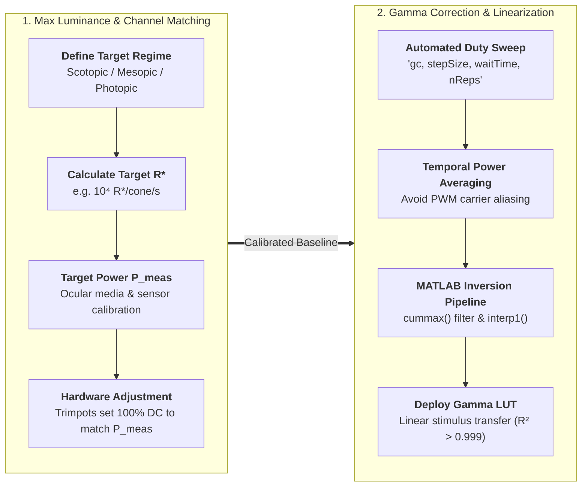
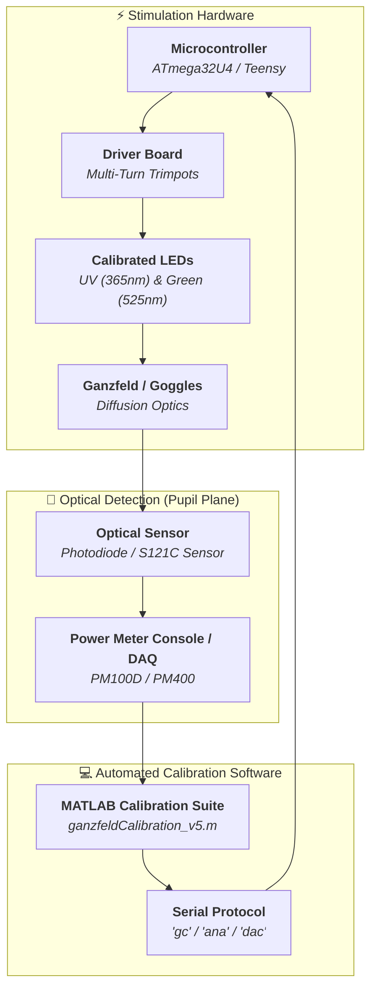

# Optical Calibration Guide

Quantitative visual neuroscience and psychophysics require precise radiometric and photometric calibration. Because LEDs and driver electronics exhibit physical non-linearities, and because biological photoreceptors respond to absorbed photons rather than raw electrical or human-photopic metrics, calibration is divided into two distinct, essential pillars:



---

## The Two Core Pillars of Calibration

### 1. Max Luminance Configuration & Channel Matching

The first aspect of calibration establishes the **absolute dynamic range** of the stimulator:

* **Biologically Meaningful Channel Matching:** Rather than matching channels by electrical power ($\text{mW}$) or radiometric flux ($\mu\text{W}$), we balance channels according to their biological effect—specifically, their **photoisomerisation rates ($R^*$)** in target photoreceptors (e.g. matching Green LED activation of M-cones with UV LED activation of S-cones).
* **Adaptation Level Control:** By setting the maximum luminance ceiling (100% duty cycle), you place the subject's retina into the desired physiological regime:
    * **Scotopic (Rod-dominated):** $< 10^1 \, R^*/\text{rod/s}$
    * **Mesopic (Rod & Cone active):** $10^1 - 10^3 \, R^*/\text{photoreceptor/s}$
    * **Photopic (Cone-dominated, rods saturated):** $10^3 - 10^5+ \, R^*/\text{cone/s}$
* **Hardware Execution:** Because the LEDs operate at constant continuous DC at 100% duty cycle during this step, max luminance calibration can be measured cleanly with a standard optical power meter or photodiode. The operator turns the multi-turn trimpots (analog gate potentiometers on the driver board) or selects series current-limiting resistors until the exact target power level is measured.

---

### 2. Gamma Correction & Output Linearization

The second aspect of calibration ensures that **commanded stimulus intensities scale linearly**:

* **Sources of Non-Linearity:** Microcontroller PWM duty cycle does not produce a perfectly linear optical output. Non-linearities arise from:
    * Transistor switching characteristics (base-emitter $V_{\text{BE}}$ or gate threshold voltages, junction capacitance, charge storage time, and turn-on delays).
    * LED dynamic forward resistance ($V_f - I_f$) near the turn-on knee.
    * Switching rise and fall transition times at high PWM frequencies ($10-31\text{ kHz}$).
    * Optical diffusion and back-reflections in the ganzfeld dome or goggles.
* **Automated Stepping (`gc`):** The microcontroller firmware provides a dedicated serial command (`gc`) that automatically steps sequentially through duty cycles (e.g., from 0% to 100% in 2% steps) with programmable dwell times and repetitions. (A pseudorandom duty cycle order is planned for future firmware versions to eliminate junction heating hysteresis).
* **Temporal Averaging (Anti-Aliasing):** When operating at $<100\%$ duty cycle, the light output is pulsed at the PWM carrier frequency. Instantaneous sampling can alias into the PWM waveform, introducing severe noise. The measurement device (optical power meter or photodiode DAQ) must perform **temporal averaging** over a steady window (e.g., 2–3 seconds per step) to capture the true time-averaged optical power.
* **Look-Up Table (LUT) Inversion:** The measured power-vs-duty-cycle curve is monotonically filtered and inverted in MATLAB to produce a Look-Up Table (LUT) stored in microcontroller flash memory (`PROGMEM`) or uploaded dynamically.

---

## Calibration Metric: Why Photoisomerisation Rates?

When choosing a calibration target, several metrics exist:

| Calibration Metric | Units | Limitations in Visual Neuroscience | Used Here? |
| :--- | :--- | :--- | :---: |
| **Radiometric Power / Irradiance** | $\mu\text{W}$, $\mu\text{W}/\text{cm}^2$ | Treats all wavelengths equally. Ignores opsin spectral sensitivity, ocular transmission, and photoreceptor geometry. | ❌ (Raw measurement only) |
| **Photometric Illuminance / Luminance** | $\text{lux}$, $\text{cd}/\text{m}^2$ | Weighted exclusively by the *human photopic luminous efficiency curve* ($V(\lambda)$, peaking at 555 nm). Completely invalid for mouse vision and UV stimulation ($365-400\text{ nm}$). | ❌ |
| **Estimated Photoisomerisation Rate ($R^*$)** | $R^*/\text{photoreceptor/s}$ | Quantifies the actual rate at which opsin photopigment molecules absorb photons and isomerise, accounting for pre-retinal ocular transmission, pupil size, detector responsivity, and outer segment collection area. | **✔️ YES (Euler Lab OVS Framework)** |

We follow the biophysical formulation developed by Euler Lab in the [Open Visual Stimulator](https://github.com/eulerlab/open-visual-stimulator) project. See the [Photoreceptor Calculations Guide](photoreceptor-calculations.md) for the complete mathematical derivation and script walkthrough of [`Calibration/ganzfeldCalibration_v5.m`](file:///d:/Code/LEDStimulation/Calibration/ganzfeldCalibration_v5.m).

---

## Calibration Equipment & Setup



### Sensor Options

1. **Option 1 (Standard): Optical Power Meter Console + Calibrated Sensor**
    * **Console:** Thorlabs PM100D, PM100USB, or PM400.
    * **Sensor:** Calibrated photodiode sensor covering UV and Visible wavelengths (e.g., **Thorlabs S121C**, **S120VC**, or **S130VC**).
    * *Advantage:* Built-in power calibration, internal integration/averaging, direct USB/serial communication with MATLAB.
2. **Option 2 (High-Speed / DAQ): Amplified Si Photodiode**
    * **Sensor:** Thorlabs **PDA100A2** switchable-gain amplified photodiode connected to a National Instruments DAQ or oscilloscope.
    * *Gain Setting:* Set transimpedance gain (e.g., $70\text{ dB}$, $2.38 \times 10^6\text{ V/A}$).
    * *Averaging:* Apply software low-pass filtering or window averaging to eliminate PWM carrier ripple.

### Physical Alignment

* Mount the sensor active area at the **exact spatial plane of the subject's eye / retina** relative to the diffuser surface.
* Seal the enclosure against ambient room light. Perform a **dark baseline measurement** ($V_{\text{dark}}$ or $P_{\text{dark}}$) with all LEDs powered off before proceeding.

---

## Step-by-Step Calibration Procedure

### Phase 1: Max Luminance Matching (Trimpot Adjustment at 100% Duty Cycle)

1. **Calculate Target Power:**
   Open [`Calibration/ganzfeldCalibration_v5.m`](file:///d:/Code/LEDStimulation/Calibration/ganzfeldCalibration_v5.m). Enter your target photoisomerisation rates $R^*_{\text{target}}$ (e.g. $10^4\,R^*/\text{cone/s}$). The script works backwards to compute the target power meter reading $P_{\text{meas}}$ in $\mu\text{W}$ at your chosen meter wavelength setting $\lambda_{\text{meas}}$ (e.g. $525\text{ nm}$ for Green, $370\text{ nm}$ for UV).
2. **Isolate Channel A:**
   Enable Channel A at 100% duty cycle:
   ```text
   sd, 100, 0
   ```
   *(or use `useChB 0` followed by `sd, 100, 0`).*
3. **Tune Channel A Trimpot:**
   Using an insulated ceramic screwdriver, adjust the multi-turn trimpot for Channel A on the driver PCB until the power meter reads the exact target $P_{\text{meas}}$ calculated in Step 1.
4. **Isolate Channel B:**
   Enable Channel B at 100% duty cycle:
   ```text
   sd, 0, 100
   ```
   *(or use `useChA 0` followed by `sd, 0, 100`).*
5. **Tune Channel B Trimpot:**
   Adjust the multi-turn trimpot for Channel B until the power meter reads the exact target $P_{\text{meas}}$ for Channel B.
6. **Record Potentiometer Settings:**
   Optionally send the `ana` command to stream analog monitor voltages on pins `A0`/`A1`, and record the final values in [`PotentiometerSettingsNotes.txt`](file:///d:/Code/LEDStimulation/PotentiometerSettingsNotes.txt).

---

### Phase 2: Automated Gamma Sweep & Temporal Averaging

1. **Initialize Sensor Logging:**
   Configure your power meter or DAQ to record time-series power measurements at $\ge 10-100\text{ Hz}$.
2. **Execute Automated Gamma Sweep (`gc`):**
   Send the gamma calibration command via serial:
   ```text
   gc, 0.02, 5000, 3
   ```
   *Parameters:*
   * `stepSize = 0.02`: Steps duty cycle in 2% increments (51 levels from 0.0 to 1.0).
   * `waitTime = 5000`: Dwells at each duty cycle for $5000\text{ ms}$ (5 seconds).
   * `nReps = 3`: Repeats the full sweep 3 times for averaging.
3. **Temporal Averaging Window:**
   In MATLAB ([`Calibration/generateGammaCorrectionLUT.m`](file:///d:/Code/LEDStimulation/Calibration/generateGammaCorrectionLUT.m)), segment each 5-second step:
   * Discard the first $1000\text{ ms}$ (transient/settling time).
   * Compute the **median power** over the remaining $3000-4000\text{ ms}$ window to reject instantaneous PWM fluctuations.

---

### Phase 3: LUT Generation & Firmware Deployment

1. **Compute Monotonic Inverse in MATLAB:**
   Run [`Calibration/generateGammaCorrectionLUT.m`](file:///d:/Code/LEDStimulation/Calibration/generateGammaCorrectionLUT.m). The script:
   * Normalizes brightness to $[0, 1]$.
   * Enforces strict monotonicity using `cummax()`.
   * Inverts the transfer function using `interp1()` onto an ideal linear grid ($0 \dots 1040$ for Leonardo DDS or $0 \dots 255$ for 8-bit registers).
2. **Export C Array:**
   The script exports a formatted C code array header (e.g., `const uint16_t PROGMEM LUT[1041] = { ... };`).
3. **Embed in Firmware:**
   * Copy the generated array into your firmware sketch (e.g. [`ArduinoCode/StimulusControlViaSerial_Leonardo_DDS_8bit_2freq/`](file:///d:/Code/LEDStimulation/ArduinoCode/StimulusControlViaSerial_Leonardo_DDS_8bit_2freq/)).
   * Flash the updated firmware to the microcontroller.
   * If using Teensy 4.1, use the `loadlut` command to upload the table dynamically over serial.
4. **Verification:**
   Repeat a brief duty-cycle sweep with gamma correction enabled (`agc, 1`) and verify that measured optical power scales with $R^2 > 0.999$ linearity against requested stimulus intensity.

