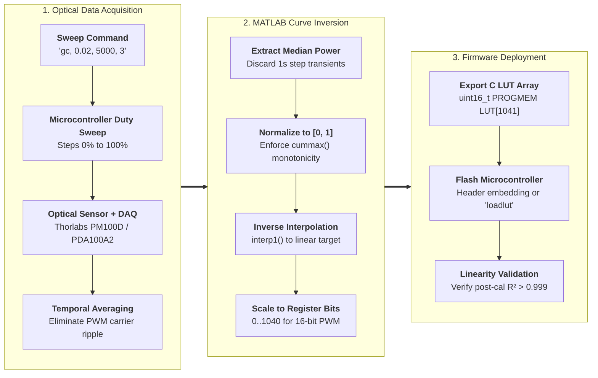
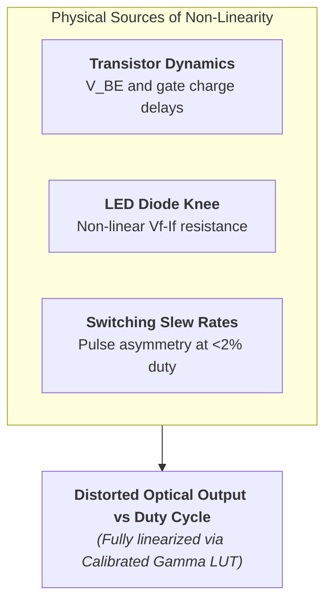

# Gamma Correction LUT Pipeline

Even when the peak forward current is calibrated, pulse-width modulated (PWM) optical output does not scale linearly with requested duty cycle. To achieve true radiometric and photometric linearity, the system uses Look-Up Tables (LUTs) stored in microcontroller Flash memory (`PROGMEM`) or uploaded dynamically to runtime RAM.



---

## 1. Physical Causes of Non-Linearity



1. **Transistor Switching Characteristics:** At low duty cycles (e.g. $< 5\%$), drive pulses may not fully saturate the driver transistors (e.g. bipolar junction transistors, FETs, or buffer stages) before the falling edge arrives. Base-emitter turn-on voltages ($V_{\text{BE}}$), gate thresholds, junction capacitance, and charge storage times introduce non-linear turn-on behavior and pulse-width distortion.
2. **LED Dynamic Forward Resistance ($V_f - I_f$):** As current increases, the internal diode dynamic resistance shifts the operating point, producing minor non-linearities in luminous efficacy.
3. **Switching Rise/Fall Transitions:** Finite switching rise and fall times introduce pulse asymmetry at microsecond PWM timescales ($10-31\text{ kHz}$ carrier frequencies).
4. **Optical Back-Reflections & Diffusion:** Diffusers and dome geometries cause subtle non-linear back-scattering at high optical power levels.

---

## 2. Automated Measurement Sweep (`gc`)

The microcontroller firmware contains an automated stepping routine (`cycleDutyCycles`) triggered by the serial command `gc`:

```text
gc, <stepSize>, <waitTime_ms>, <nReps>
```

### Example Command
```text
gc, 0.02, 5000, 3
```

| Parameter | Example Value | Description |
| :--- | :---: | :--- |
| `stepSize` | `0.02` | Duty cycle step increment as a fraction ($0.02 = 2\%$ steps $\rightarrow 51$ test points from $0.0$ to $1.0$). |
| `waitTime_ms` | `5000` | Dwell duration at each duty cycle in milliseconds ($5000\text{ ms} = 5\text{ s}$). |
| `nReps` | `3` | Number of complete repetitions of the sweep to average over. |

During the sweep, the firmware outputs each duty cycle value over serial, sets the hardware OCR compare registers, pauses for `waitTime_ms`, and emits `-1` upon completion before restoring the default 50% baseline.

*(Note: Current firmware steps sequentially through duty cycles; pseudorandom duty cycle presentation is planned for future firmware versions to eliminate potential junction heating hysteresis).*

---

## 3. Temporal Averaging & Anti-Aliasing

!!! critical "Crucial Anti-Aliasing Requirement"
    When operating at **$< 100\%$ duty cycles**, the LED light output is rapidly pulsed at the PWM carrier frequency ($10\text{ kHz} - 31.25\text{ kHz}$).
    
    If the optical sensor samples instantaneously at discrete points without temporal integration, the readings will **alias into the high-frequency PWM switching waveform**, resulting in massive noise and corrupt calibration data.

### Best Practices for Signal Acquisition:
1. **Thorlabs Optical Power Meters (PM100D, PM100USB, PM400):**
   These consoles have internal analog bandwidth filtering and digital integration, naturally providing clean time-averaged power readings.
2. **Amplified Photodiodes (PDA100A2 + DAQ):**
   * Apply an analog low-pass filter (e.g. $100\text{ Hz}$ cutoff) or set the DAQ sampling rate to $\ge 100\text{ kHz}$ and compute boxcar/block averages over 1-second windows.
3. **MATLAB Steady-State Windowing:**
   In [`Calibration/generateGammaCorrectionLUT.m`](file:///d:/Code/LEDStimulation/Calibration/generateGammaCorrectionLUT.m), power is extracted by:
   * Waiting $1000\text{ ms}$ after each step transition to allow electronic and thermal stabilization.
   * Computing the **median optical power** over the remaining $3000-4000\text{ ms}$ steady-state window.

---

## 4. MATLAB Processing & Curve Inversion

The script [`Calibration/generateGammaCorrectionLUT.m`](file:///d:/Code/LEDStimulation/Calibration/generateGammaCorrectionLUT.m) processes the sweep data through the following steps:

```matlab
% 1. Extract steady-state median power for each duty cycle
for icycle = 1:numel(dutyCyclesOrig)
    temp_startTime = startTime + waitTime*(icycle-1) + delayTime;
    temp_endTime   = temp_startTime + takeValsDuration;
    temp_idx = find(power_table.Time >= temp_startTime & power_table.Time <= temp_endTime);
    powerValsOrig(icycle) = median(power_table.Power(temp_idx));
end

% 2. Normalize measured brightness to [0, 1]
measured_brightness = powerValsOrig / max(powerValsOrig);

% 3. Enforce strict monotonicity (optical power must never decrease with duty cycle)
monotonic_brightness = cummax(measured_brightness);

% 4. Remove duplicate brightness levels to ensure bijective interpolation
[unique_brightness, unique_idx] = unique(monotonic_brightness, 'stable');
unique_duty_cycle = dutyCyclesOrig(unique_idx);

% 5. Create ideal linear target grid (e.g., 1041 levels for Timer 1 DDS)
num_levels = 1041;
target_brightness = linspace(0, 1, num_levels);

% 6. Invert the transfer function: map target brightness -> required duty cycle
corrected_pixel_values = interp1(unique_brightness, unique_duty_cycle, target_brightness, 'linear', 'extrap');

% 7. Scale to timer register units and enforce boundaries
LUT = round(corrected_pixel_values * (num_levels - 1) / 100);
LUT = max(0, min(num_levels - 1, LUT)); % Clip to [0, 1040]
LUT = cummax(LUT);                      % Guarantee non-decreasing
LUT(1) = 0;                             % Guarantee absolute zero when off
```

---

## 5. Resolution Scaling & Architecture Mapping

Different firmware architectures and timer resolutions require different LUT table lengths:

| Architecture | Firmware Sketch | Timer Mode | Resolution | LUT Table Length | Script |
| :--- | :--- | :--- | :---: | :---: | :--- |
| **Arduino Leonardo DDS** | `StimulusControlViaSerial_Leonardo_DDS_8bit_2freq.ino` | Timer 1 (16-bit, TOP=1040) | $10.02\text{ bit}$ | **$1041$ entries** | `generateGammaCorrectionLUT.m` |
| **Arduino Leonardo 8-bit** | `StimulusControlViaSerial_Leonardo_v8.ino` | Timer 1 / 4 (8-bit, TOP=255) | $8\text{ bit}$ | **$256$ entries** | `mapLUTs.m` |
| **Teensy 4.1 FlexPWM** | `LEDStimController_Teensy41_DDS.ino` | FlexPWM Submodules | $16\text{ bit}$ | **$65536$ entries** (or interpolated $1024$) | Dynamic upload |

### Multi-Architecture Fractional Conversion (`mapLUTs.m`)

The script [`Calibration/mapLUTs.m`](file:///d:/Code/LEDStimulation/Calibration/mapLUTs.m) allows high-resolution calibration curves to be scaled to 8-bit or 16-bit microcontrollers using Piecewise Cubic Hermite Interpolating Polynomials (`pchip`), evaluating quantization deviation:

```matlab
% Convert normalized geometric curve to 8-bit scale
fractional_curve = interp1(linspace(0, 1, 1041), ChA1LUT_orig / 1040, linspace(0, 1, 256), 'pchip');
ChA1LUT_8bit = round(fractional_curve * 255);
ChA1LUT_8bit = max(0, min(255, ChA1LUT_8bit));
```

---

## 6. Embedding in Firmware & Dynamic Loading

### Option A: Static Compilation in Flash (`PROGMEM`)

[`generateGammaCorrectionLUT.m`](file:///d:/Code/LEDStimulation/Calibration/generateGammaCorrectionLUT.m) exports formatted C header arrays:

```cpp
// Stored in microcontroller flash memory to conserve SRAM
const uint16_t PROGMEM ChA_LUT[1041] = {
    0, 2, 5, 8, 11, 14, 18, 22, 26, 30,
    34, 38, 43, 47, 52, 57, 62, 67, 72, 77,
    ...
    1020, 1025, 1030, 1035, 1040
};
```

* Embed this table directly into your sketch.
* At runtime, use `agc, 1` to enable gamma correction or `agc, 0` to bypass.

### Option B: Dynamic Serial Upload (`loadlut` on Teensy 4.1)

For Teensy 4.1 firmware ([`ArduinoCode/LEDStimController_Teensy41_DDS/`](file:///d:/Code/LEDStimulation/ArduinoCode/LEDStimController_Teensy41_DDS/)), LUTs can be streamed directly over USB Serial into RAM without recompiling firmware:

```text
loadlut, <channel>, <val0>, <val1>, <val2>, ...
```

---

## 7. Verification & Linearity Validation

After flashing the calibrated LUT:
1. Re-run an automated duty cycle sweep with gamma correction enabled (`agc, 1`).
2. Plot measured optical power ($\mu\text{W}$) against commanded stimulus amplitude ($0.0 \dots 1.0$).
3. Perform linear regression ($y = m \cdot x + c$). A successful calibration yields $R^2 \ge 0.999$, ensuring distortion-free sinusoidal, chirp, and pulse stimulus rendering.
