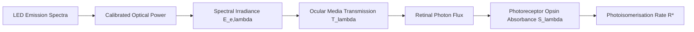

# Photoreceptor Quantification & Spectral Calculations

To map physical LED emission intensities (measured in $\mu\text{W}$) to biologically meaningful activation of specific photoreceptors, the system calculates effective photoisomerisation rates per photoreceptor type per second ($R^*/\text{photoreceptor/s}$).

!!! note "Work in Progress"
    This documentation section is currently a work in progress.

---

## Quantification Framework

---

## 1. Reference Data Files

Located in [`Calibration/`](file:///d:/Code/LEDStimulation/Calibration/):
* **`mouse_cone_opsins.txt`**: Normalized spectral absorbance profiles for:
  * S-opsin (UV-sensitive cone opsin, peak $\approx 360\text{ nm}$)
  * M-opsin (Green-sensitive cone opsin, peak $\approx 508\text{ nm}$)
  * Rhodopsin (Rod opsin, peak $\approx 498\text{ nm}$)
* **`Transmission_mouse_eye.txt`**: Wavelength-dependent transmission spectra of the pre-retinal ocular media (cornea, lens, vitreous humor), critical for accurate UV power delivery.

---

## 2. Mathematical Formulation

### 1. Retinal Irradiance ($E_e(\lambda)$)
Calculated from the measured radiant flux $\Phi_e(\lambda)$ and the effective pupil / retinal surface area:
$$E_{e,\text{retina}}(\lambda) = \frac{\Phi_e(\lambda) \cdot T(\lambda)}{A_{\text{retina}}}$$

### 2. Spectral Photon Flux Density ($N_p(\lambda)$)
Converting radiant power to photon arrival rate using Planck's constant ($h$) and the speed of light ($c$):
$$N_p(\lambda) = \frac{E_{e,\text{retina}}(\lambda) \cdot \lambda}{h \cdot c}$$

### 3. Isomerisation Rate ($R^*$)
Integrating the product of photon flux density, photoreceptor collection area ($A_c$), and normalized opsin spectral sensitivity ($S_{\text{opsin}}(\lambda)$):
$$R^* = A_c \int N_p(\lambda) \cdot S_{\text{opsin}}(\lambda) \, d\lambda$$

---

## 3. MATLAB Analysis Scripts

* [`getLEDSpectraFromPowerMeter.m`](file:///d:/Code/LEDStimulation/Calibration/getLEDSpectraFromPowerMeter.m) & [`getLEDSpectraFromPhotodiode.m`](file:///d:/Code/LEDStimulation/Calibration/getLEDSpectraFromPhotodiode.m): Combines emission spectra with measured power meter readings to compute exact cone/rod isolating contrasts and absolute photon flux.
