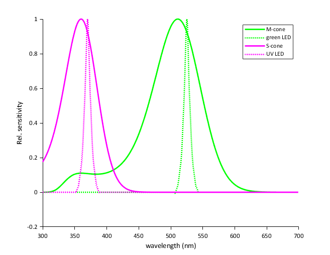
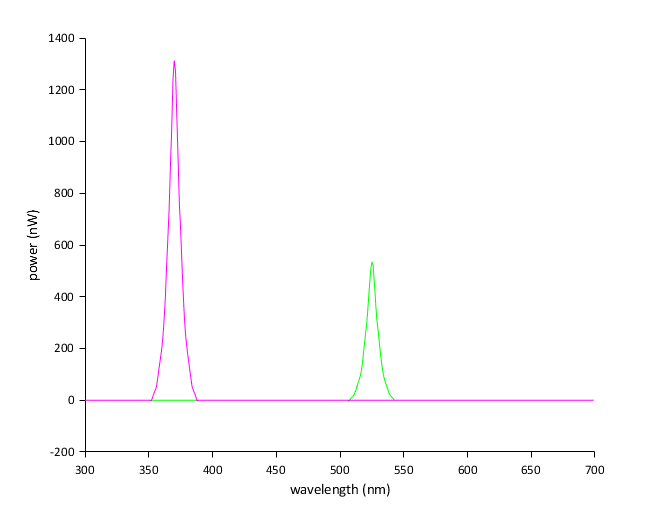
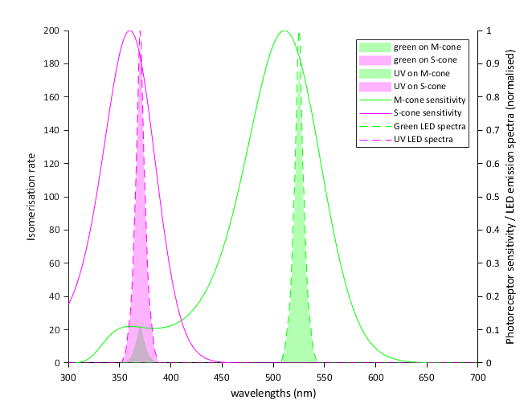

# Photoreceptor Quantification & Spectral Calculations

To achieve biologically meaningful visual stimulation in neuroscience and psychophysics, optical power emitted by the LEDs must be quantified in terms of **photoisomerisation rates ($R^*$)** per photoreceptor type per second ($\text{isomerisations}/\text{photoreceptor}/\text{s}$, or $10^3\,R^*$).

This page provides a complete walkthrough of the calibration script [`Calibration/ganzfeldCalibration_v5.m`](file:///d:/Code/LEDStimulation/Calibration/ganzfeldCalibration_v5.m), which implements the biophysical framework developed by Euler Lab in the [Open Visual Stimulator](https://github.com/eulerlab/open-visual-stimulator) project.

---

## Calibration Logic & Workflow

The calibration mathematics connects biological target regimes to physical bench measurements through two directional flows:

### 1. Forward Calculation (Data Analysis in MATLAB)
Converts an empirical optical power meter or photodiode reading into absolute photoisomerisation rates ($R^*$):

$$\text{Power Meter Reading } P_{\text{meas}} \xrightarrow{C_{\text{factor}}} \text{True Radiant Power } P_{\text{true}} \xrightarrow{T_{\text{eye}}, \, \frac{A_{\text{pupil}}}{A_{\text{retina}}}} \text{Retinal Power } P_{\text{retina}} \xrightarrow{S_{\text{opsin}}, \, a_c} \text{Isomerisation Rate } R^*$$

* **Purpose:** Quantifies exactly how many photoisomerisations per cone or rod per second are elicited by the current stimulator output.
* **Implementation:** Executed automatically by [`Calibration/ganzfeldCalibration_v5.m`](file:///d:/Code/LEDStimulation/Calibration/ganzfeldCalibration_v5.m).

### 2. Inverse Calculation (Experimental Bench Calibration)
Works backwards from a desired physiological adaptation state to determine the required reading on the power meter console:

$$\text{Target Rate } R^*_{\text{target}} \longrightarrow \text{Required True Power } P_{\text{true}} \longrightarrow \text{Target Meter Reading } P_{\text{meas}} \longrightarrow \text{Hardware Trimpot Adjustment}$$

* **Purpose:** Tells the experimenter the exact target reading ($\mu\text{W}$) to set on the Thorlabs power meter console when adjusting the driver board potentiometers at 100% duty cycle.
* **Linear Scaling:** Because the forward transfer function from radiant power to photoisomerisation rate is strictly linear, the inverse mapping is an exact scalar proportionality.

---

## 1. Physical Constants & Biological Parameters

The calculations in [`ganzfeldCalibration_v5.m`](file:///d:/Code/LEDStimulation/Calibration/ganzfeldCalibration_v5.m) rely on physical constants and experimentally verified mouse ocular properties:

### Physical Constants

| Variable | MATLAB Name | Value | Unit | Description |
| :--- | :--- | :--- | :--- | :--- |
| $h$ | `h` | $4.135667 \times 10^{-15}$ | $\text{eV}\cdot\text{s}$ | Planck's constant |
| $c$ | `c` | $299,792,458$ | $\text{m/s}$ | Speed of light in vacuum |
| — | `eV_per_J` | $6.242 \times 10^{18}$ | $\text{eV/J}$ | Conversion factor from Joules to electron-volts |

### Photoreceptor Parameters (Mouse)

Photoreceptor opsin absorbance profiles are loaded from [`Calibration/mouse_cone_opsins.txt`](file:///d:/Code/LEDStimulation/Calibration/mouse_cone_opsins.txt):

| Photoreceptor | MATLAB Name | Peak Wavelength ($\lambda_{\text{peak}}$) | End-on Collection Area ($a_c, a_r$) | Sensitivity Profile ($S_{\text{PR}}(\lambda)$) | Reference |
| :--- | :--- | :---: | :---: | :--- | :--- |
| **M-cone** | `mouse_M_cone` | $511\text{ nm}$ | $0.2\,\mu\text{m}^2$ | `mouse_opsins.Mopsin` | Nikonov et al., 2006 |
| **S-cone** | `mouse_S_cone` | $360\text{ nm}$ | $0.2\,\mu\text{m}^2$ | `mouse_opsins.Sopsin` | Nikonov et al., 2006 |
| **Rod** | `mouse_rod` | $510\text{ nm}$ | $0.5\,\mu\text{m}^2$ | `mouse_opsins.Mopsin` | Nikonov et al., 2006 |

!!! note "Collection Area ($a_c, a_r$)"
    The end-on light collection area ($a_c = 0.2\,\mu\text{m}^2$ for dark-adapted wt mouse cones, $a_r = 0.5\,\mu\text{m}^2$ for rods) represents the effective physical cross-section through which incoming photons are captured and absorbed by outer segment opsin molecules.

<figure markdown="span" style="max-width: 520px; margin: 1.5em auto; text-align: center;">
  
  <figcaption style="font-size: 0.85em; color: var(--md-default-fg-color--light); margin-top: 0.5em;"><strong>Figure 1:</strong> Relative spectral sensitivity of mouse M-cone (green solid) and S-cone (magenta solid) opsins alongside peak-normalized emission spectra of the Green LED (green dotted) and UV LED (magenta dotted).</figcaption>
</figure>

### Ocular & Anatomical Properties

* **Pre-retinal Ocular Transmission ($T_{\text{eye}}(\lambda)$):** Loaded from [`Calibration/Transmission_mouse_eye.txt`](file:///d:/Code/LEDStimulation/Calibration/Transmission_mouse_eye.txt), accounting for wavelength-dependent absorption by the cornea, crystalline lens, and vitreous humor (especially significant in the near-UV band $< 400\text{ nm}$).
* **Pupil Area ($A_{\text{pupil}}$):**
    * Stationary state: $A_{\text{pupil}} \approx 0.21\,\text{mm}^2$
    * Running / Dilated state: $A_{\text{pupil}} \approx 1.91\,\text{mm}^2$
* **Retinal Surface Area ($A_{\text{retina}}$):**
    For an adult mouse eye with axial length $d = 3.0\text{ mm}$ ($r = 1.5\text{ mm}$):

    $$A_{\text{retina}} \approx 0.6 \cdot \pi \cdot d^2 = 0.6 \cdot \pi \cdot (3.0\,\text{mm})^2 \approx 16.96\,\text{mm}^2$$

* **Pupil-to-Retina Geometric Ratio:**

    $$k_{\text{pupil}} = \frac{A_{\text{pupil}}}{A_{\text{retina}}} = \frac{1.91\,\text{mm}^2}{16.96\,\text{mm}^2} \approx 0.1126$$

### Sensor Parameters

* **Thorlabs Photodiode Sensor (S121C, S120VC, S130VC):**
    * Active Sensor Area: $A_{\text{detect}} = 9700\,\mu\text{m} \times 9700\,\mu\text{m} = 94.09 \times 10^6\,\mu\text{m}^2 = 94.09\,\text{mm}^2$
    * Calibrated responsivity curve $R(\lambda)$ loaded from `Calibration/PowerMeterCalibrationFiles/`.
* **Thorlabs PDA100A2 Amplified Sensor:**
    * Active Sensor Area: $A_{\text{detect}} = 75.4 \times 10^6\,\mu\text{m}^2 = 75.4\,\text{mm}^2$

---

## 2. Forward Calculation: Power Meter to $R^*$

Here is the exact mathematical sequence executed in [`Calibration/ganzfeldCalibration_v5.m`](file:///d:/Code/LEDStimulation/Calibration/ganzfeldCalibration_v5.m):

### Step 1: Broad-Band Sensor Responsivity Correction

Optical power meters (such as the Thorlabs PM100D) compute power by dividing the measured detector photocurrent by the sensor responsivity at a single user-entered calibration wavelength: $R(\lambda_{\text{meas}})$. Because LEDs have a broad spectral emission $S(\lambda)$ (typically $20-40\text{ nm}$ FWHM), the raw meter reading $P_{\text{meas}}$ is biased.

The true radiant power $P_{\text{true}}$ is recovered using [`Calibration/getLEDSpectraFromPowerMeter.m`](file:///d:/Code/LEDStimulation/Calibration/getLEDSpectraFromPowerMeter.m):

$$C_{\text{factor}} = \frac{R(\lambda_{\text{meas}}) \int S(\lambda) \, d\lambda}{\int S(\lambda) R(\lambda) \, d\lambda}$$

$$P_{\text{true}} = P_{\text{meas}} \cdot C_{\text{factor}}$$

The absolute spectral power distribution $P(\lambda)$ across 1-nm bins ($\Delta\lambda = 1\text{ nm}$) from $300\text{ nm}$ to $699\text{ nm}$ is:

$$P(\lambda) = P_{\text{true}} \cdot \frac{S(\lambda)}{\int S(\lambda) \, d\lambda} \quad [\text{W/nm}]$$

<figure markdown="span" style="max-width: 500px; margin: 1.5em auto; text-align: center;">
  
  <figcaption style="font-size: 0.85em; color: var(--md-default-fg-color--light); margin-top: 0.5em;"><strong>Figure 2:</strong> Responsivity-corrected spectral radiant power ($P(\lambda)$ in $\text{nW}$) for the Green and UV channels.</figcaption>
</figure>

!!! tip "Alternative: PDA100A2 Amplified Photodiode"
    If using the PDA100A2 transimpedance photodiode ([`Calibration/getLEDSpectraFromPhotodiode.m`](file:///d:/Code/LEDStimulation/Calibration/getLEDSpectraFromPhotodiode.m)):

    $$I_p = \frac{V_{\text{measured}} - V_{\text{dark}}}{\text{Gain}_{\text{Hi-Z}}} \quad [\text{Amperes}]$$

    $$R_{\text{eff}} = \frac{\int S(\lambda) R(\lambda) \, d\lambda}{\int S(\lambda) \, d\lambda} \quad [\text{A/W}]$$

    $$P_{\text{true}} = \frac{I_p}{R_{\text{eff}}} \quad [\text{Watts}]$$

---

### Step 2: Pre-Retinal Transmission & Retinal Geometry

The spectral power reaching the photoreceptor outer segment layer inside the eye is attenuated by the ocular media $T_{\text{eye}}(\lambda)$ and scaled by the pupil-to-retina area ratio:

$$P_{\text{retina}}(\lambda) = P(\lambda) \cdot T_{\text{eye}}(\lambda) \cdot \left(\frac{A_{\text{pupil}}}{A_{\text{retina}}}\right)$$

---

### Step 3: Spectral Overlap & Relative Co-Excitation

For LED $i$ and photoreceptor type $j$, the relative spectral co-excitation fraction is calculated from the normalized spectral overlap:

$$\text{Co-excitation}_{i,j} = \frac{\int S_{\text{PR}, j}(\lambda) \cdot S_{\text{LED\_corr\_norm}, i}(\lambda) \, d\lambda}{\int S_{\text{LED\_corr\_norm}, i}(\lambda) \, d\lambda}$$

Where $S_{\text{LED\_corr\_norm}, i}(\lambda)$ is the peak-normalized retinal LED spectrum.

---

### Step 4: Photon Energy, Photon Flux Density & Isomerisation Rate

1. **Wavelength-dependent photon energy ($Q(\lambda)$ in $\text{eV}$):**

    $$Q(\lambda) = \frac{h \cdot c}{\lambda \cdot 10^{-9}}$$

2. **Spectral photon flux ($\Phi_{\text{photon}}(\lambda)$ in $\text{photons/s}$):**

    $$\Phi_{\text{photon}}(\lambda) = \frac{P_{\text{retina}}(\lambda) \cdot (\text{eV\_per\_J})}{Q(\lambda)}$$

3. **Photon flux density arriving at the sensor detector plane ($E(\lambda)$ in $\text{photons}/(\text{s}\cdot\mu\text{m}^2)$):**

    $$E(\lambda) = \frac{\Phi_{\text{photon}}(\lambda)}{A_{\text{detect}}}$$

4. **Total photoisomerisation rate ($R^*$ in $\text{isomerisations}/\text{photoreceptor}/\text{s}$):**

    $$R^*_{i,j} = a_{\text{collect}, j} \cdot \text{Co-excitation}_{i,j} \int E_i(\lambda) \, d\lambda$$

In [`ganzfeldCalibration_v5.m`](file:///d:/Code/LEDStimulation/Calibration/ganzfeldCalibration_v5.m), rates are reported in units of $10^3\,R^*/\text{s}$ ($10^3\,\text{photons/s}$).

<figure markdown="span" style="max-width: 540px; margin: 1.5em auto; text-align: center;">
  
  <figcaption style="font-size: 0.85em; color: var(--md-default-fg-color--light); margin-top: 0.5em;"><strong>Figure 3:</strong> Calculated spectral photoisomerisation rates ($R^*$ density, left axis shaded areas) across wavelengths for Green and UV channels on M-cones and S-cones, alongside normalized opsin sensitivities (solid lines) and LED emissions (dashed lines, right axis).</figcaption>
</figure>

---

## 3. Working Backwards: From Target $R^*$ to Measured Power

In experimental design, you start with a target photoisomerisation rate $R^*_{\text{target}}$ (e.g. $10^4\,R^*/\text{cone/s}$) and need to determine the **exact power reading to calibrate the hardware to at 100% duty cycle**.

Because the forward pipeline from radiant power to $R^*$ is strictly linear:

$$\frac{R^*}{P_{\text{true}}} = k_{\text{iso}} = \text{constant}$$

### Inverse Calibration Procedure

1. **Run a Reference Calibration in MATLAB:**
   Execute `ganzfeldCalibration_v5.m` with an arbitrary reference power $P_{\text{ref}}$ (e.g. $P_{\text{meas, ref}} = 6.05\,\mu\text{W}$).
   Record the resulting reference photoisomerisation rate $R^*_{\text{ref}}$.
2. **Compute the Required True Power ($P_{\text{true, target}}$):**

    $$P_{\text{true, target}} = P_{\text{true, ref}} \cdot \left(\frac{R^*_{\text{target}}}{R^*_{\text{ref}}}\right)$$

3. **Compute the Target Power Meter Reading ($P_{\text{meas, target}}$):**
   For your power meter console set to wavelength $\lambda_{\text{meas}}$:

    $$P_{\text{meas, target}} = \frac{P_{\text{true, target}}}{C_{\text{factor}}}$$

4. **Physical Adjustment at the Rig:**
   * Set the LED channel to 100% duty cycle (`sd, 100, 0` for Green, `sd, 0, 100` for UV).
   * Turn the channel's multi-turn potentiometer on the driver PCB with an insulated trimmer tool until the console reads exactly $P_{\text{meas, target}}$.

---

### Concrete Worked Numerical Example

Based on the actual calibration values from [`Calibration/ganzfeldCalibration_v5.m`](file:///d:/Code/LEDStimulation/Calibration/ganzfeldCalibration_v5.m) using a Thorlabs S121C sensor ($A_{\text{detect}} = 94.09\,\text{mm}^2$) and running mouse eye geometry ($A_{\text{pupil}} = 1.91\,\text{mm}^2$):

#### Channel A: Green LED ($\lambda_{\text{peak}} \approx 525\text{ nm}$)
* **Measurement Wavelength Setting:** $\lambda_{\text{meas}} = 525\text{ nm}$
* **Sensor Responsivity Correction:** $C_{\text{factor, Green}} \approx 1.018$
* **Target Photoisomerisation Rate:** $R^*_{\text{target, M-cone}} = 25.0 \times 10^3 \, R^*/\text{cone/s}$
* **Calculation:**
    * A power meter reading of $P_{\text{meas}} = 6.05\,\mu\text{W}$ yields $P_{\text{true}} = 6.16\,\mu\text{W}$, producing an M-cone isomerisation rate of $R^* = 25.32 \times 10^3\,R^*/\text{cone/s}$.
    * To set an exact target of $25.0 \times 10^3\,R^*/\text{s}$:

        $$P_{\text{meas, target}} = 6.05\,\mu\text{W} \cdot \left(\frac{25.0}{25.32}\right) = 5.97\,\mu\text{W}$$

* **Action:** Adjust the Green channel trimpot until the PM100D reads **$5.97\,\mu\text{W}$**.

#### Channel B: UV LED ($\lambda_{\text{peak}} \approx 370\text{ nm}$)
* **Measurement Wavelength Setting:** $\lambda_{\text{meas}} = 370\text{ nm}$
* **Sensor Responsivity Correction:** $C_{\text{factor, UV}} \approx 1.042$
* **Target Photoisomerisation Rate:** $R^*_{\text{target, S-cone}} = 25.0 \times 10^3 \, R^*/\text{cone/s}$ (for iso-effective cone stimulation)
* **Calculation:**
    * A power meter reading of $P_{\text{meas}} = 15.0\,\mu\text{W}$ yields $P_{\text{true}} = 15.63\,\mu\text{W}$, producing an S-cone isomerisation rate of $R^* = 26.48 \times 10^3\,R^*/\text{cone/s}$ (after accounting for corneal/lens UV absorption).
    * To achieve an exact match of $25.0 \times 10^3\,R^*/\text{s}$:

        $$P_{\text{meas, target}} = 15.0\,\mu\text{W} \cdot \left(\frac{25.0}{26.48}\right) = 14.16\,\mu\text{W}$$

* **Action:** Adjust the UV channel trimpot until the PM100D reads **$14.16\,\mu\text{W}$**.

---

## 4. Photoreceptor Co-Excitation & Crosstalk Matrix

Because the spectral emission profiles of the LEDs overlap with the absorption spectra of multiple photoreceptors, stimulation is rarely 100% opsin-isolated.

The co-excitation matrix calculated by [`Calibration/ganzfeldCalibration_v5.m`](file:///d:/Code/LEDStimulation/Calibration/ganzfeldCalibration_v5.m) shows the relative activation:

| Stimulus LED | M-Cone ($511\text{ nm}$) Activation | S-Cone ($360\text{ nm}$) Activation | Rod ($510\text{ nm}$) Activation | Primary Target |
| :--- | :---: | :---: | :---: | :--- |
| **Green LED ($525\text{ nm}$)** | **$88.4\%$** | $< 0.1\%$ | $87.1\%$ | **M-cone / Rod** |
| **UV LED ($370\text{ nm}$)** | $4.2\%$ | **$91.6\%$** | $3.9\%$ | **S-cone** |

!!! tip "Opsin-Isolating Contrasts / Silent Substitution"
    Because the Green LED causes negligible excitation of S-cones ($<0.1\%$), green modulation provides clean M-cone and rod stimulation without activating S-cones.
    Conversely, the UV LED exhibits minor co-excitation on M-cones ($\approx 4.2\%$). For strict silent substitution experiments, this crosstalk can be cancelled by driving a small antiphase compensation signal on the Green channel.
