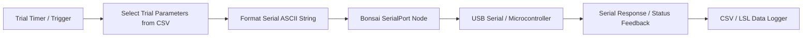

# Bonsai Workflow Overview

[Bonsai](https://bonsai-rx.org/) is an open-source visual reactive programming environment used here to coordinate experiment state, stream serial commands to the microcontroller, record behavioural sensors, and synchronize multi-modal data streams.

!!! note "Work in Progress"
    This documentation section is currently a work in progress.

---

## 1. Environment Setup

* **Bonsai Version:** Compatible with Bonsai 2.7.x / 2.8.x.
* **Required Package Dependencies:**
  * `Bonsai.Core` & `Bonsai.Design`
  * `Bonsai.System` (IO & Serial Ports)
  * `Bonsai.Arduino`
  * `Bonsai.Dsp` & `Bonsai.Numerics`
  * `Bonsai.Shaders` / `Bonsai.Vision` *(for display/camera workflows)*
  * `Bonsai.LabStreamingLayer` *(for LSL multi-modal stream synchronization)*

---

## 2. Solution Structure

Located in [`BonsaiCode/`](file:///d:/Code/LEDStimulation/BonsaiCode/):
* `BonsaiCode.sln` / `Extensions.csproj` — C# extensions for custom Bonsai data processing nodes.
* `.bonsai/` — Package configuration and local environment dependencies.
* `*.bonsai` & `*.bonsai.layout` — Visual workflow definitions and GUI layout arrangements.
* `StimulusCSVfiles/` — Pre-defined stimulus parameter tables and trial condition matrices.

---

## 3. Core Workflow Architecture

* **Serial Communication Node:** Configured for the microcontroller's COM port at `115200` baud.
* **Non-Blocking Execution:** Serial commands are dispatched asynchronously, allowing the host PC to continuously stream eye-tracking video, IMU data, or digital sync markers without dropped frames.
