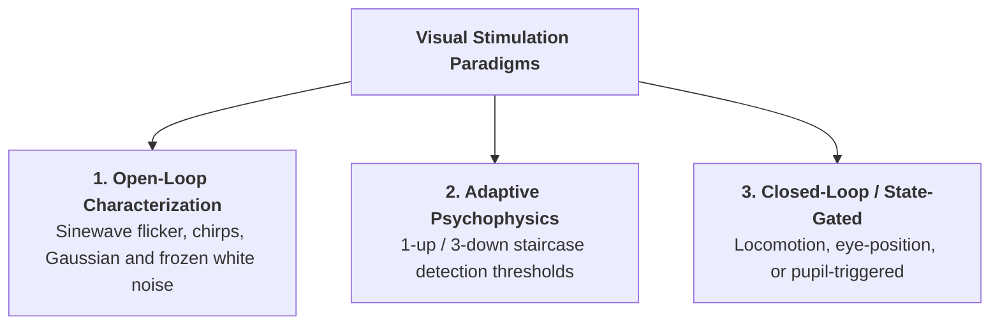

# Visual Stimulation Paradigms

This section documents the primary visual stimulation paradigms implemented in the Bonsai workflows. These protocols are adaptable for both animal physiology and human psychophysics setups.

!!! note "Work in Progress"
    This documentation section is currently a work in progress.

---

## Paradigm Summary

---

## 1. Standard Characterization Battery (`LEDstimulation_normal.bonsai`)

* **Workflow:** [`BonsaiCode/LEDstimulation_normal.bonsai`](file:///d:/Code/LEDStimulation/BonsaiCode/LEDstimulation_normal.bonsai)
* **Description:** Sequentially presents a randomized block of standard stimuli (sinewave flickers, frequency chirps, Gaussian white noise, and contrast-switching adaptation sequences) defined in a trial parameter CSV.
* **Outputs:** Automatically logs stimulus metadata, trial onset timestamps, and digital marker pulses.

---

## 2. Adaptive Psychometric Staircase (`LEDstimulation_staircase.bonsai`)

* **Workflows:**
  * [`LEDstimulation_staircase.bonsai`](file:///d:/Code/LEDStimulation/BonsaiCode/LEDstimulation_staircase.bonsai) (Single condition)
  * [`LEDstimulation_staircase_multiCond.bonsai`](file:///d:/Code/LEDStimulation/BonsaiCode/LEDstimulation_staircase_multiCond.bonsai) (Interleaved multi-condition)
* **Description:** Implements adaptive staircase procedures (e.g. 1-up / 3-down, accelerated stochastic approximation) to rapidly estimate visual detection or discrimination thresholds.
* **Usage:** Interleaves contrast or frequency parameters dynamically based on behavioural responses (e.g., lick detection, key presses, or eye movements).

---

## 3. State-Dependent / Closed-Loop Stimulation (`LEDstimulation_StateDependent.bonsai`)

* **Workflow:** [`BonsaiCode/LEDstimulation_StateDependent.bonsai`](file:///d:/Code/LEDStimulation/BonsaiCode/LEDstimulation_StateDependent.bonsai)
* **Description:** Monitors live subject state (e.g., treadmill running speed, pupil diameter, or IMU motion) and dynamically triggers visual stimulation when specific behavioral thresholds are met.

---

## 4. Manual Method of Adjustment (`ManualMethodOfAdjustment.bonsai`)

* **Workflow:** [`BonsaiCode/ManualMethodOfAdjustment.bonsai`](file:///d:/Code/LEDStimulation/BonsaiCode/ManualMethodOfAdjustment.bonsai)
* **Description:** Enables continuous, real-time subject control of luminance or chromatic contrast balance via a keyboard or rotary knob to determine subjective equivalence or perceptual nulling points.
