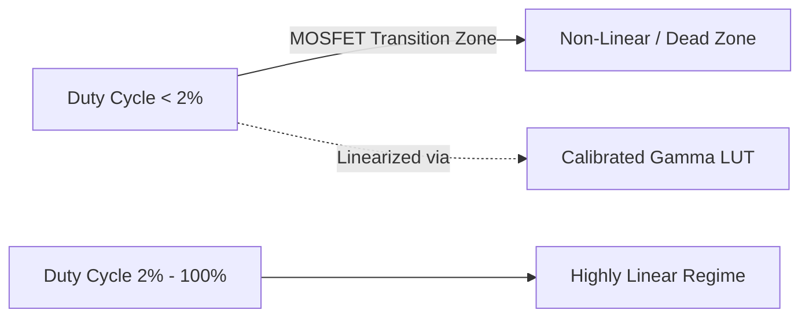

# Performance Characteristics & Technical Notes

This document details the switching dynamics, temporal resolution limits, thermal considerations, and synchronization constraints of the stimulation platform.

---

## 1. Switching Dynamics & Rise/Fall Limitations

The system uses high-frequency switching to achieve granular intensity modulation. In low-side MOSFET designs with capacitive filtering (snubber circuits):

* **Rise/Fall Time:** Measured at approximately **$1\ \mu\text{s}$** ($10\%$ to $90\%$ amplitude).
* **Impact on PWM Fidelity:**
  * For a carrier PWM frequency of **$10\text{ kHz}$**, the total PWM cycle period is $100\ \mu\text{s}$.
  * A $1\ \mu\text{s}$ rise time represents $\approx 1\%$ of the total period.
  * Because a complete PWM cycle includes both a rising and a falling edge, approximately **$2\%$** of the duty cycle period is consumed by transition states.
  * **Operational Recommendation:** Avoid operating below $2\%$ duty cycle for linear stimulus generation unless an empirical gamma correction LUT specifically compensates for the dead zone.

---

## 2. Dynamic Range & Linearity

* **Dead Zone:** For pulse widths shorter than the MOSFET slew time ($< 1\ \mu\text{s}$), the channel does not fully turn on, leading to non-monotonic luminance drop-offs.
* **Compensation:** The firmware Look-Up Tables (`PROGMEM gammaLUT`) map raw values to avoid unlinearized dead-zone regions.

---

## 3. Thermal Considerations

* **Ohmic / Linear Operation:** When potentiometers are adjusted to scale gate voltages into the linear (ohmic) region for current limiting, the MOSFET dissipates power as heat.
* **Thermal Drift ($V_{\text{th}}$ Shift):** Prolonged continuous high-current stimulation can warm the transistor package, causing subtle shifts in the gate threshold voltage ($V_{\text{th}}$) and drain current ($I_D$).
* **Mitigation:**
  * Allow a 5–10 minute warm-up period at baseline luminance before acquiring critical quantitative calibration data.
  * Ensure the aluminium baseplate acts as a thermal heatsink for high-power LED strings.

---

## 4. Optical Synchronization Notes

* **Photodiode Bandwidth:** Standard photodiodes connected to an oscilloscope will capture the $7.68 - 10\text{ kHz}$ PWM carrier pulses rather than an analog average.
* **Hardware Sync:** Always use the dedicated hardware digital output lines (**Pin 4** Indicator and **Pin 5** Stimulus Status) or analog low-pass filtered photodiode amplifiers to align neural recording traces with stimulus events.
