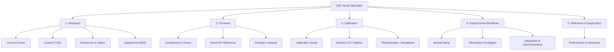

# LED Visual Stimulator Documentation

Welcome to the comprehensive documentation for the **Full-Field LED Visual Stimulator**. This system is designed for high-precision, temporally controlled visual stimulation across neuroscience, psychophysics, and sensory physiology applications (including both animal model and human subject paradigms).

---

## Documentation Navigation

---

## Sections

### [1. Hardware](file:///d:/Code/LEDStimulation/docs/1-hardware/circuit-and-driver.md)
Detailed hardware designs, schematic specifications, component sourcing, and mechanical setups:
- [Circuit & Driver Design](file:///d:/Code/LEDStimulation/docs/1-hardware/circuit-and-driver.md) *(Undergoing updates)*
- [Custom PCBs](file:///d:/Code/LEDStimulation/docs/1-hardware/custom-pcbs.md) — LED array boards and driver status.
- [Enclosures & Optics](file:///d:/Code/LEDStimulation/docs/1-hardware/enclosure-and-optics/panel-enclosure.md):
  - [Full-Field Panel Enclosure](file:///d:/Code/LEDStimulation/docs/1-hardware/enclosure-and-optics/panel-enclosure.md) — MakerBeam frame, baseplate CAD, magnetic diffusion clamps.
  - [Wearable Glasses Setup](file:///d:/Code/LEDStimulation/docs/1-hardware/enclosure-and-optics/wearable-glasses.md) — Pupil Labs Neon frame mount & diffuser.
- [Bill of Materials (BOM)](file:///d:/Code/LEDStimulation/docs/1-hardware/bill-of-materials.md) — Categorized components, quantities, and sourcing links.

---

### [2. Firmware](file:///d:/Code/LEDStimulation/docs/2-firmware/architecture-and-timers.md)
Microcontroller firmware architecture, timer interrupts, and serial control protocol:
- [Architecture & Timers](file:///d:/Code/LEDStimulation/docs/2-firmware/architecture-and-timers.md) — ATmega32u4 Timer1 (16-bit PWM), Timer3 (CTC interrupts), and DDS signal synthesis.
- [Serial API Reference](file:///d:/Code/LEDStimulation/docs/2-firmware/serial-api-reference.md) — Complete command set (`s`, `wn`, `fwn`, `cs`, `fs`, `sdt`, etc.) with argument syntax and examples.
- [Firmware Variants](file:///d:/Code/LEDStimulation/docs/2-firmware/firmware-variants.md) — Comparing Leonardo v8, Leonardo DDS, Teensy 4.1, and IMU tracking sketches.

---

### [3. Calibration](file:///d:/Code/LEDStimulation/docs/3-calibration/calibration-guide.md)
Optical calibration, linearization, and receptor-specific quantifications:
- [Calibration Guide](file:///d:/Code/LEDStimulation/docs/3-calibration/calibration-guide.md) — Radiometric and photometric calibration workflow.
- [Gamma LUT Pipeline](file:///d:/Code/LEDStimulation/docs/3-calibration/gamma-lut-pipeline.md) — Automated duty-cycle sweeps and generating PROGMEM look-up tables in MATLAB.
- [Photoreceptor Calculations](file:///d:/Code/LEDStimulation/docs/3-calibration/photoreceptor-calculations.md) — Spectral irradiance, ocular transmission, and opsin photoisomerisation rates ($R^*/\text{photoreceptor/s}$).

---

### [4. Experimental Workflows](file:///d:/Code/LEDStimulation/docs/4-experimental-workflows/bonsai-overview.md)
Orchestrating experiments using Bonsai reactive programming and external synchronization:
- [Bonsai Overview](file:///d:/Code/LEDStimulation/docs/4-experimental-workflows/bonsai-overview.md) — Setting up the visual reactive programming environment and dependencies.
- [Stimulation Paradigms](file:///d:/Code/LEDStimulation/docs/4-experimental-workflows/stimulation-paradigms.md) — Running flickers, sweeps, Gaussian noise, and psychometric staircases.
- [Integration & Multi-Modal Sync](file:///d:/Code/LEDStimulation/docs/4-experimental-workflows/integration-and-sync.md) — Pupil Labs Neon eye tracking, IMU motion recording, and LabStreamingLayer (LSL) / LabRecorder.

---

### [5. Reference & Diagnostics](file:///d:/Code/LEDStimulation/docs/5-reference/performance-and-sync.md)
- [Performance & Hardware Limits](file:///d:/Code/LEDStimulation/docs/5-reference/performance-and-sync.md) — Switching dynamics, rise/fall times, duty cycle dead zones, thermal stability, and TTL synchronization pins.
