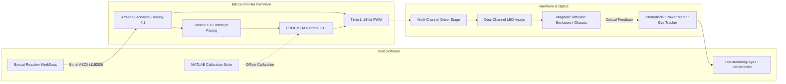

# Full-Field LED Visual Stimulator

An open-source, high-precision visual stimulation platform designed for visual neuroscience, sensory physiology, and human psychophysics. The system delivers temporally agile, multi-chromatic optical stimulation (e.g., Green for M-cones/rods and UV for S-cones, or custom multi-spectral arrays) with sub-millisecond precision.

---

## Key Capabilities

- **High-Resolution Temporal Modulation:** 16-bit Phase-Correct carrier PWM (~7.68–10 kHz) combined with hardware-interrupt pacing (Timer3 CTC ISR) eliminates visible digital stepping and software loop jitter.
- **Rich Stimulus Battery:** Native microsecond-timed generation of sinusoidal flickers, Gaussian white noise (with Central Limit Theorem PRNG), contrast-switching adaptation sequences, exponential frequency chirps, and stepped luminance pulses.
- **Quantitative Radiometric Calibration:** End-to-end MATLAB calibration pipeline mapping raw duty cycles to linearized lookup tables (LUTs) and calculating exact photoreceptor isomerisation rates ($R^*/\text{photoreceptor/s}$).
- **Flexible Form Factors:** Supports both 200mm full-field panel enclosures (with magnetic diffusion clamping) and miniature wearable mounts for Pupil Labs Neon eye-tracking glasses.
- **Reactive Experiment Orchestration:** Full integration with [Bonsai](https://bonsai-rx.org/) for closed-loop, state-dependent, adaptive psychometric staircase, and LabStreamingLayer (LSL) multi-modal recording.

---

## System Architecture



---

## Quickstart Guide

### 1. Flash the Firmware
1. Open `ArduinoCode/StimulusControlViaSerial_Leonardo_v8/StimulusControlViaSerial_Leonardo_v8.ino` in the Arduino IDE.
2. Select **Arduino Leonardo** as your board and choose the corresponding COM port.
3. Click **Upload**.

### 2. Connect Hardware & Verify
1. Connect your LED driver to the designated MCU pins (PWM: Pins 9 & 10; Indicators: Pins 4 & 5).
2. Open the Serial Monitor at `115200` baud.
3. Send a test sinusoidal flicker:
   ```text
   s, 3000, 2.0, 0.0, 0.5, 0.8, 0.8
   ```
   *(Runs a 3-second, 2 Hz antiphase flicker on Channels A and B at 80% contrast).*

### 3. Launch Experimental Workflows
Open [Bonsai](https://bonsai-rx.org/) and load one of the pre-built visual stimulation workflows from `BonsaiCode/` (e.g., `LEDstimulation_normal.bonsai` or `ManualMethodOfAdjustment.bonsai`).

---

## Navigation & Sections

Use the left sidebar to navigate between documentation sections:

- **[1. Hardware](1-hardware/circuit-and-driver.md)**: Schematics, custom PCBs, CAD enclosures, and Bill of Materials.
- **[2. Firmware](2-firmware/architecture-and-timers.md)**: Hardware timer registers, DDS engines, and full Serial API command reference.
- **[3. Calibration](3-calibration/calibration-guide.md)**: Radiometric power measurement, MATLAB gamma LUT pipeline, and photoreceptor opsin calculations.
- **[4. Experimental Workflows](4-experimental-workflows/bonsai-overview.md)**: Bonsai visual workflows, animal/human paradigms, Pupil Labs Neon integration, and LSL synchronization.
- **[5. Reference](5-reference/performance-and-sync.md)**: Switching dynamics, dead zones, thermal stability, and hardware trigger sync.
